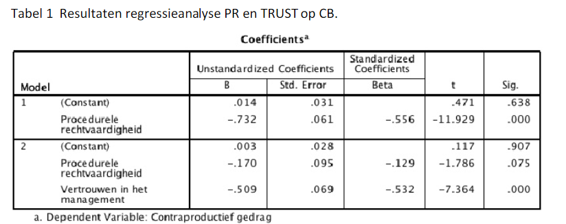

```{r, echo = FALSE, results = "hide"}
include_supplement("1552659287289.png", recursive = TRUE)
```

Question
========
The idea is that injustice will lead to counterproductive behavior (counter productive behavior = "**CB**"), such as tardiness, stealing office supplies, low collegiality and the like. The question is what mechanism, if any, links justice and "**CB**." The idea is that unjust procedures lead to more "**CB**." Next, we can we can ask why procedural injustice leads to "**CB**" leads. One possibility is that procedural injustice undermines trust in management and that the lack of trust will lead to more "**CB**." Conversely, experiencing procedural justice ("**PR**") will increase trust ("**TRUST**") and thereby decrease counterproductive behavior ("**CB**").  
  
We obtain the following output from a hierarchical regression belonging to this study.  
What is the unstandardized indirect effect of this mediation analysis?   
  



Solution
========

Meta-information
================
exname: vufsw-mediation-0303-en
extype: num
exsolution: -0.562
extol: 0.000999999999999945
exsection: inferential statistics/regression/multiple linear regression/mediation
exextra[ID]: 40d93
exextra[Type]: calculation
exextra[Program]: calculator
exextra[Language]: English
exextra[Level]: statistical reasoning

