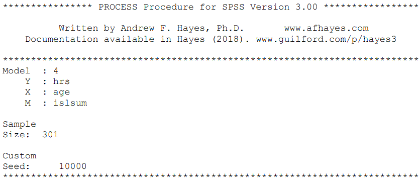
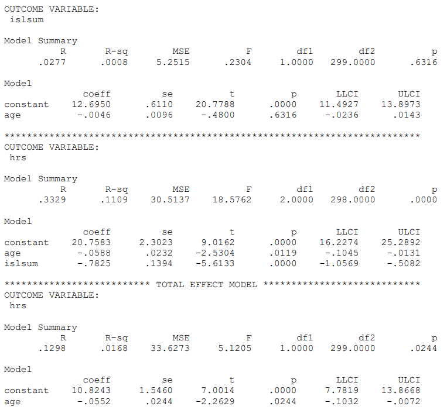

```{r, echo = FALSE, results = "hide"}
include_supplement("Capture12890.gif", recursive = TRUE)
include_supplement("Capture112891.gif", recursive = TRUE)
```

Question
========
We examine whether social support ("**islsum***"*) mediates the effect of age ("**age***"*) on depression ("**hrs***"*) mediates. Below is the output of this analysis.  
Which method can be used to least correctly tested/which method do you prefer not to use?   
  
  



Answerlist
----------
* Baron and Kennedy
* Sobel key
* Bootstrap

Solution
========

Answerlist
----------
* True
* False
* False

Meta-information
================
exname: vufsw-mediation-0304-en
extype: schoice
exsolution: 100
exshuffle: TRUE
exsection: inferential statistics/regression/multiple linear regression/mediation
exextra[Type]: conceptual
exextra[Program]: NA
exextra[Language]: English
exextra[Level]: statistical reasoning

