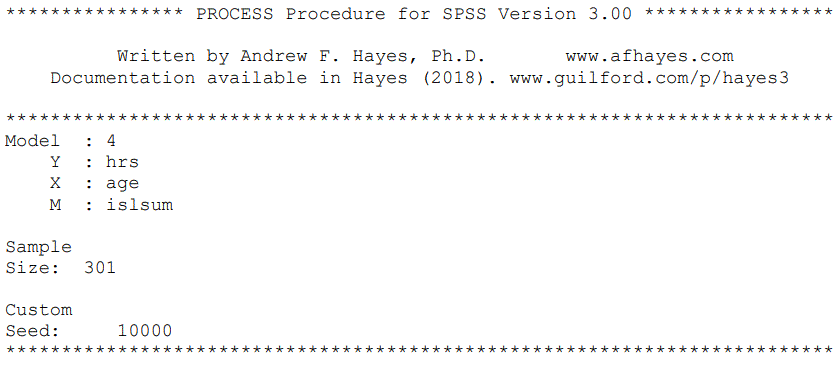
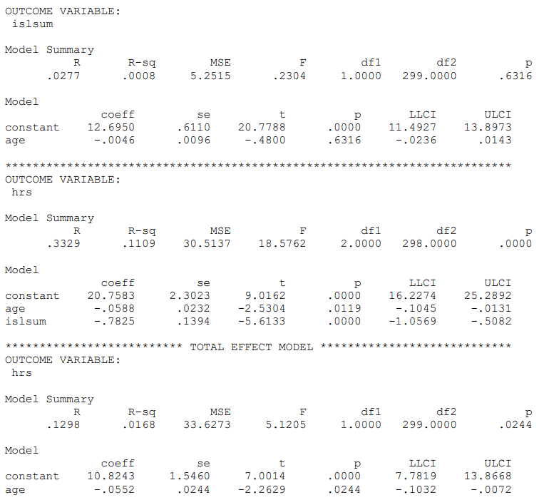

```{r, echo = FALSE, results = "hide"}
include_supplement("Capture12890.gif", recursive = TRUE)
include_supplement("Capture112891.gif", recursive = TRUE)
```

Question
========
We examine whether social support ("**islsum***"*) mediates the effect of age ("**age***"*) on depression ("**hrs***"*) mediates. Below find the output of this analysis.  
Based on this output, what is the indirect effect? *Round to 4 decimals.*  
  
  




Solution
========

Meta-information
================
exname: vufsw-mediation-0305-en
extype: num
exsolution: 0.0036
extol: 0
exsection: inferential statistics/regression/multiple linear regression/mediation
exextra[ID]: e28c9
exextra[Type]: calculation
exextra[Program]: calculator
exextra[Language]: English
exextra[Level]: statistical reasoning

