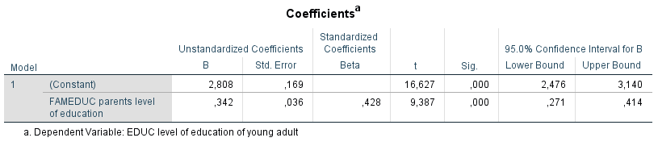

```{r, echo = FALSE, results = "hide"}
include_supplement("1606293471454.png", recursive = TRUE)
include_supplement("1606293416277.png", recursive = TRUE)
```

Question
========
De onderstaande analyses zijn uitgevoerd op gegevens van een steekproef van jonge volwassenen in de leeftijd tussen 20 en 40 jaar die via een vragenlijst over hun culturele voorkeuren. De onderzoeksvragen zijn:  
  
1: in hoeverre de voorkeur voor culturele feestdagen (variabele: CULVAC (schaal 0-1): een hogere score betekent een sterkere voorkeur voor culturele feestdagen) wordt veroorzaakt door de sociale positie van het ouderlijk milieu (gemeten is de opleiding van de ouders (variabele: FAMEDUC (schaal 0-7), variërend van basisonderwijs (0) tot universiteit (7), een hogere score betekent een hogere opleiding) en  2: of deze relatie verklaard kan worden door het eigen bereikte opleidingsniveau (variabele: FAMEDUC) van onderwijs (variabele: EDUC (schaal 0-6), variërend van lager beroeps onderwijs (0) tot universiteit (6), een hogere score betekent een hogere opleiding).  
  
Hieronder staan de resultaten van twee regressieanalyses.  
  
Regressieanalyse 1:  
  

  
Regressieanalyse 1:  
  
  

  
Met hoeveel procent neemt het effect van 'FAMEDUC' af als je model 1 vergelijkt met model 2 in de eerste regressieanalyse? vergelijkt tussen model 1 en model 2 in de eerste regressieanalyse (gebruik de niet-gestandaardiseerde coëfficiënten)?   
* Eef een getal met één decimaal, geen %-teken*


Solution
========

Meta-information
================
exname: vufsw-mediation-1314-nl
extype: num
exsolution: 48.4
extol: 0.200000000000003
exsection: inferential statistics/regression/multiple linear regression/mediation
exextra[ID]: 8015a
exextra[Type]: interpreting output
exextra[Program]: calculator
exextra[Language]: Dutch
exextra[Level]: statistical literacy

