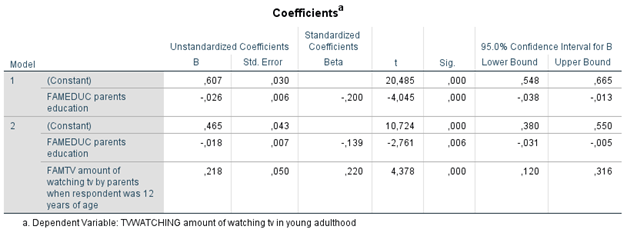

```{r, echo = FALSE, results = "hide"}
include_supplement("1602951598702.png", recursive = TRUE)
include_supplement("1602951629778.png", recursive = TRUE)
```

Question
========
The analyses below were conducted on data from a sample of young adults between the ages of 20 and 40 who were surveyed via a questionnaire that asked about their cultural preferences. The research questions are (1) to what extent the amount of television viewing (variable: TV WATCHING (scale 0-1): a higher score means more TV watched) is caused by the social position of the parental environment (measured is parents' education (variable: FAMEDUC (scale 0-7), ranging from primary education (0) to university (7) a higher score means higher education) and (2) whether this relationship can be explained by the extent to which previously (when the respondent was 12 years old) television was watched by the parents (variable: FAMTV (scale 0-1), a higher score means more TV was watched).  
Below are the results of two regression analyses.  
  
Regression 1:  

  
Regression 2:  

  
  
According to **model 1in the first regression analysis** do respondents who grew up in families with the most highly educated parents than respondents who grew up in families with the least educated parents?

Answerlist
----------
* .182
* .425
* .581
* .607

Solution
========

Answerlist
----------
* True
* False
* False
* False

Meta-information
================
exname: vufsw-mediation-1361-en
extype: schoice
exsolution: 1000
exshuffle: TRUE
exsection: inferential statistics/regression/multiple linear regression/mediation
exextra[ID]: 4711a
exextra[Type]: interpreting output
exextra[Program]: calculator
exextra[Language]: English
exextra[Level]: statistical literacy

