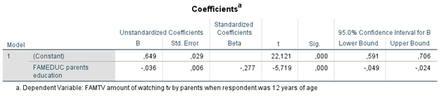

```{r, echo = FALSE, results = "hide"}
include_supplement("1602951598702.png", recursive = TRUE)
include_supplement("1602951629778.png", recursive = TRUE)
```

Question
========
The analyses below were conducted on data from a sample of young adults between the ages of 20 and 40 who were surveyed via a questionnaire that asked about their cultural preferences. The research questions are (1) to what extent the amount of television viewing (variable: TV WATCHING (scale 0-1): a higher score means more TV watched) is caused by the social position of the parental environment (measured is parents' education (variable: FAMEDUC (scale 0-7), ranging from primary education (0) to university (7) a higher score means higher education) and (2) whether this relationship can be explained by the extent to which previously (when the respondent was 12 years old) television was watched by the parents (variable: FAMTV (scale 0-1), a higher score means that more TV was watched).  
Below are the results of two regression analyses.  
  
Regression 1:  

  
Regression 2:  

  
How do you interpret the constant **in model 2 in the first regression analysis**?

Answerlist
----------
* The constant .465 indicates the lowest score on "TVwatching," where the education of the parents and the degree of television watching by the parents were previously held constant
* The constant .465 indicates the predicted score on 'tvwatching' for respondents with a mean score on parental education and a mean score on the degree of television watching by parents previously earlier
* The constant .465 indicates the predicted score on 'tvwatching' for respondents whose parents were least educated (0) and used to watched the least television (0)
* The constant .465 indicates the effect of parental education on 'TVwatching' for respondents whose parents used to watch the least watched television (0)

Solution
========

Answerlist
----------
* False
* False
* True
* False

Meta-information
================
exname: vufsw-mediation-1364-en
extype: schoice
exsolution: 0010
exshuffle: TRUE
exsection: inferential statistics/regression/multiple linear regression/mediation
exextra[Type]: interpreting output
exextra[Program]: NA
exextra[Language]: English
exextra[Level]: statistical literacy

