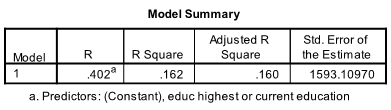

```{r, echo = FALSE, results = "hide"}
include_supplement("1657817799761.png", recursive = TRUE)
include_supplement("1657817294616.png", recursive = TRUE)
include_supplement("1657817809039.png", recursive = TRUE)
include_supplement("1657817812641.png", recursive = TRUE)
include_supplement("1657817324817.png", recursive = TRUE)
```

Question
========
Data on nightlife activities was used for this question. Below is a path model (without errors). The popular culture (zjcul1) is explained by education (educ) and income. The output below it shows the results of the path analyses. *NB: don't be not be confused if your answer differs slightly from the answer categories; these may be rounding errors.*  
  



  
How large is the arrow e associated with income (see model summary)?

Answerlist
----------
* 0.598
* 0.838
* 0.402
* 0.915

Solution
========

Answerlist
----------
* False
* False
* False
* True

Meta-information
================
exname: vufsw-mediation-2009-en
extype: schoice
exsolution: 0001
exshuffle: TRUE
exsection: inferential statistics/regression/multiple linear regression/mediation
exextra[ID]: 37a17
exextra[Type]: interpreting output
exextra[Program]: calculator
exextra[Language]: English
exextra[Level]: statistical thinking

