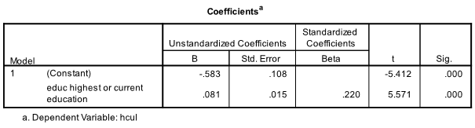

```{r, echo = FALSE, results = "hide"}
include_supplement("1657817289375.png", recursive = TRUE)
include_supplement("1657817294616.png", recursive = TRUE)
include_supplement("1657817315395.png", recursive = TRUE)
include_supplement("1657817306031.png", recursive = TRUE)
include_supplement("1657817601627.png", recursive = TRUE)
```

Question
========
Data on nightlife activities was used for this question. Below is a path model (without errors). The high culture (hcul) is explained by education (educ) and income. The output below shows the results of the path analyses. *NB: don't be confused if your answer differs slightly from the answer categories; these may be rounding errors.* 
* [](1657817289375.png)*




  
How large is the arrow e associated with higher culture (hcul) (see model summary)?

Answerlist
----------
* 0.061
* 0.247
* 0.939
* 0.969

Solution
========

Answerlist
----------
* False
* False
* False
* True

Meta-information
================
exname: vufsw-mediation-2013-en
extype: schoice
exsolution: 0001
exshuffle: TRUE
exsection: inferential statistics/regression/multiple linear regression/mediation
exextra[Type]: interpreting output
exextra[Program]: calculator
exextra[Language]: English
exextra[Level]: statistical thinking

