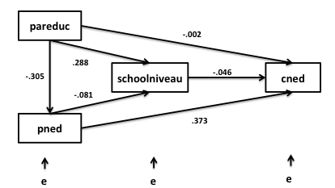

```{r, echo = FALSE, results = "hide"}
include_supplement("Schermafbeelding__2019-01-30__om__13.05.49.png", recursive = TRUE)
```

Question
========

  
The path analysis above examined how the preference for Dutch music (René Froger, Frans Bauer) of young people (cned ) is related to their own school level, parental education (pareduc) and parents' preference for Dutch music (pned).  
  
Are pareduc and school level endogenous or exogenous variables?

Answerlist
----------
* Pareduc exogenous; school level exogenous
* Pareduc exogenous; school level endogenous
* Pareduc endogenous; school level exogenous
* Pareduc endogenous; school level endogenous

Solution
========

Answerlist
----------
* False
* True
* False
* False

Meta-information
================
exname: vufsw-mediation-2018-en
extype: schoice
exsolution: 0100
exshuffle: TRUE
exsection: inferential statistics/regression/multiple linear regression/mediation
exextra[ID]: 2189e
exextra[Type]: conceptual
exextra[Program]: NA
exextra[Language]: English
exextra[Level]: statistical literacy

