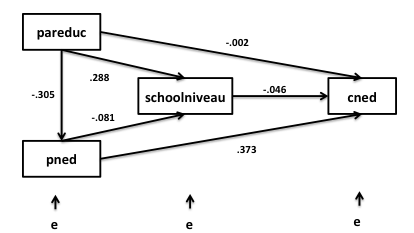

```{r, echo = FALSE, results = "hide"}
include_supplement("Schermafbeelding__2019-01-30__om__13.05.49.png", recursive = TRUE)
```

Question
========

  
The path analysis above examined how the preference for Dutch music (René Froger, Frans Bauer) of young people (cned ) is related to their own school level, parental education (pareduc) and parents' preference for Dutch music (pned).  

The path analysis above examined how the preference for Dutch music (René Froger, Frans Bauer) of adolescents (cned ) is related to their own school level, parental education (pareduc) and parents' preference for Dutch music (pned).  
  
Are pareduc and cned endogenous or exogenous variables?

Answerlist
----------
* Pareduc exogenous; cned endogenous
* Pareduc endogenous; cned exogenous
* Pareduc exogenous; cned exogenous
* Pareduc endogenous; cned endogenous

Solution
========

Answerlist
----------
* True
* False
* False
* False

Meta-information
================
exname: vufsw-mediation-2023-en
extype: schoice
exsolution: 1000
exshuffle: TRUE
exsection: inferential statistics/regression/multiple linear regression/mediation
exextra[ID]: e17d9
exextra[Type]: conceptual
exextra[Program]: NA
exextra[Language]: English
exextra[Level]: statistical literacy

