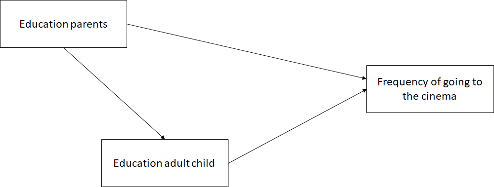

```{r, echo = FALSE, results = "hide"}
include_supplement("1598533153247.png", recursive = TRUE)
```

Question
========
  
  

  
  
Als in de bovenstaande figuur geldt: Y = frequentie van bioscoopbezoek, X = opleiding van de ouders, dan is de opleiding van het volwassen kind een ...

Answerlist
----------
* Een mediërende variabele
* Een verstorende variabele
* Zowel een bemiddelende als een onderliggende variabele
* Geen intermediaire en geen verstorende variabele

Solution
========

Answerlist
----------
* Waar
* Onwaar
* Onwaar
* Onwaar

Meta-information
================
exname: vufsw-mediation-3034-nl
extype: schoice
exsolution: 1000
exshuffle: TRUE
exsection: inferential statistics/regression/multiple linear regression/mediation
exextra[Type]: conceptual
exextra[Program]: NA
exextra[Language]: Dutch
exextra[Level]: statistical literacy

