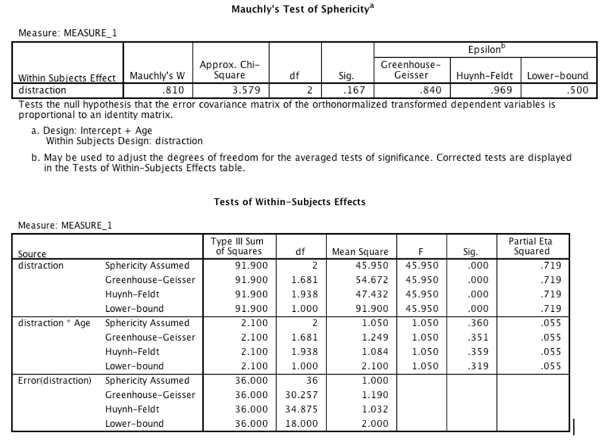

```{r, echo = FALSE, results = "hide"}
include_supplement("Capture5.png", recursive = TRUE)
```

Question
========
An experiment was done to compare the effect of having a conversation
via a hands-free mobile phone, having a conversation with an in-car
passenger, and no distraction (baseline) on driving accuracy. Twenty
participants from two different age groups (18–25 years and 26–40 years)
took part. All participants in both age groups took part in all three
conditions of the experiment (in counterbalanced order), and their
driving accuracy was measured by a layperson who remained unaware of the
experimental hypothesis. Which of the following sentences is the correct
interpretation of the main effect of distraction?  
  


Answerlist
----------
* The main effect of distraction is significant,  *F* (2, 36) = 45.95,
   *p* &lt; .001. This effect tells us that average ratings of driving
  accuracy differed across the three types of distraction.
* The main effect of distraction is significant, *F*(1.681, 30.257) =
  45.95, *p*  &lt;  .001. This effect tells us that average ratings of
  driving accuracy differed across the three types of distraction.
* The age of the driver significantly interacted with the type of
  distraction,  *F*(2, 36) = 45.95, *p* &lt; .001. This effect tells us
  that average ratings of driving accuracy across the different types of
  distraction were different in the two age groups.
* It is not possible to interpret the main effect of distraction because
  the assumption of sphericity is violated.

Solution
========


Mauchly's test for sphericity shows that the assumption of sphericity is
not violated. Therefore, we look at the row 'Sphericity assumed". The
question is about the main effect, so we look at the first panel of the
table. The F-value is *F* (2, 36) = 45.95 and the p-value is .000.
Therefore, the option " The main effect of distraction is significant,
 *F* (2, 36) = 45.95,  *p*  = .00. This effect tells us that the profile
of ratings of driving accuracy differed across the three types of
distraction" is correct.


Language  
English & Nederlands

M&T Mixed design ANOVA  
Default value

M&T MVA  
Standaardwaarde
Answerlist
----------
* True
* False
* False
* False

Meta-information
================
exname: vufsw-mixed design anova-1062-en
extype: schoice
exsolution: 1000
exshuffle: TRUE
exsection: inferential statistics/parametric techniques/anova/mixed design anova
exextra[Type]: interpreting out
exextra[Program]: NA
exextra[Language]: English
exextra[Level]: statistical thinking

