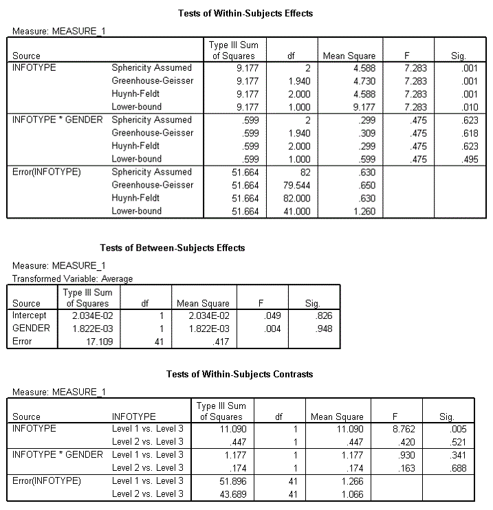
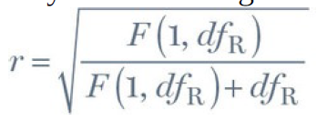

```{r, echo = FALSE, results = "hide"}
include_supplement("Capture12428.gif")
include_supplement("effectsizecontrast.png")
```

Question
========
Op basis van onderstaande output rapporteerden Field and Lawson (2003)
rapporteerden de effecten van het geven van achtereenvolgens positieve,
negatieve of geen informatie aan dezelfde kinderen in de leeftijd van
7-9 jaar over voor hen onbekende dieren. Deze variabele werd 'Infotype'
genoemd (niveaus van Infotype werden in deze volgorde ingevoerd:
positieve informatie, negatieve informatie, geen informatie). Het
geslacht van het kind werd ook onderzocht. De uitkomst was de tijd
(gecentreerd) die de kinderen nodig hadden om hun hand in een doos te
steken met daarin het dier waarover ze *positieve*, *negatieve* of *geen
informatie* dier hadden gekregen. De assumptie van sphericity is niet
geschonden.  
  
  
  
  
Contrastanalyse werd op deze gegevens uitgevoerd (niveaus van Infotype
werden in de volgende volgorde ingevoerd: positieve informatie,
negatieve informatie, geen informatie). Bereken met behulp van de
SPSS-output hierboven de effectgrootte (r) voor de interactie tussen het
contrast tussen positieve informatie en geen informatie en geslacht.
Rond af op vier decimalen.


Solution
========


You use the formula for the r of the contrasten  
  
F(1,41)=0.930 and df<sub>R</sub>=41. The outcome is 0.1489.


Language  
English & Nederlands

M&T Mixed design ANOVA  
Default value

M&T MVA  
Standaardwaarde

Meta-information
================
exname: vufsw-mixed design anova-1064-nl
extype: num
exsolution: 0.1489
extol: 0.000399999999999998
exsection: inferential statistics/parametric techniques/anova/mixed design anova
exextra[Type]: interpreting out
exextra[Program]: calculator
exextra[Language]: dutch
exextra[Level]: statistical thinking

