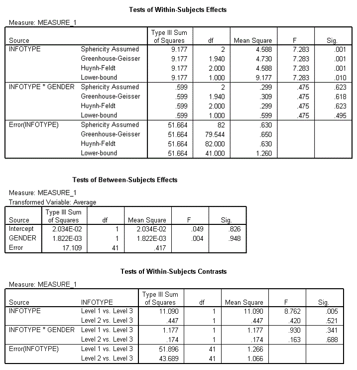

```{r, echo = FALSE, results = "hide"}
include_supplement("Capture12428.gif", recursive = TRUE)
```

Question
========
Op basis van de onderstaande ouput rapporteerden Field en Lawson (2003) de effecten van het geven van positieve, negatieve of geen informatie over nieuwe dieren aan dezelfde kinderen van 7-9 jaar. geen informatie te geven over nieuwe dieren. Deze variabele werd "**Infotype**" (niveaus van Infotype werden ingevoerd in de volgende volgorde: positieve informatie, negatieve informatie, geen informatie). Het geslacht van het kind werd ook onderzocht. De uitkomst was de gemiddelde gecentreerde tijd die de kinderen nodig hadden om hun hand in een vakje te steken waarin ze geloofden dat dat het positieve, negatieve of geen informatie dier was gehuisvest. De assumptie van sfericiteit is niet geschonden.  
  
  


Er werd een contrastanalyse uitgevoerd op deze gegevens (infotypeniveaus werden ingevoerd in de volgende volgorde: positieve informatie, negatieve informatie, geen informatie). Gebruik de bovenstaande SPSS-uitvoer, bereken de effectgrootte (*r*) van de interactie tussen het contrast tussen negatieve informatie en geen informatie en geslacht. *Rond uw antwoord af op **vier **decimalen.*


Solution
========

Je gebruikt de formule voor de *r* van de contrasten  r = sqrt [ (F(1,df<sub>R</sub>)) / (F(1,df<sub>R</sub>) + df<sub>R</sub>) \]  
  
F(1,41)=0,163 en df<sub>R</sub>=41. De uitkomst is 0,0629.

Taal Engels & Nederlands

M&T Gemengd ontwerp ANOVA Standaardwaarde

M&T MVA Standaardwaarde

Meta-information
================
exname: vufsw-mixeddesignanova-0249-nl
extype: num
exsolution: 0.0629
extol: 5e-04
exsection: inferential statistics/parametric techniques/anova/mixed design anova
exextra[ID]: 4316d
exextra[Type]: calculation
exextra[Program]: calculator
exextra[Language]: Dutch
exextra[Level]: statistical reasoning

