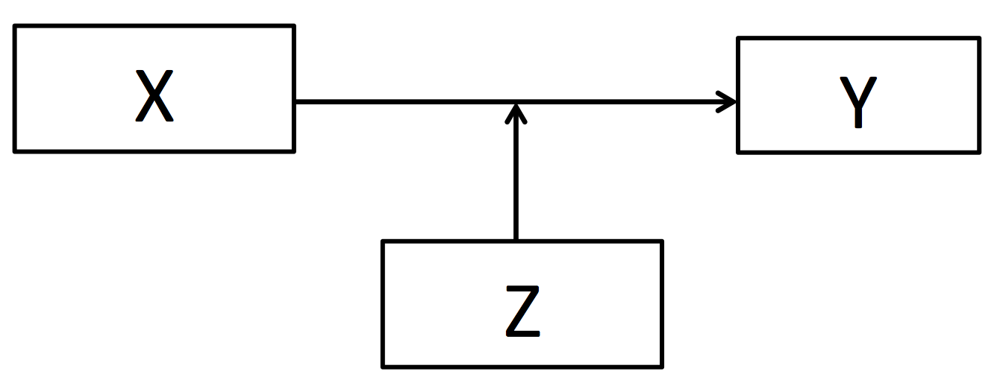

```{r, echo = FALSE, results = "hide"}
include_supplement("Screen__Shot__2020-05-02__at__17.31.19.png", recursive = TRUE)
```

Question
========
Below is the causal model in a moderation analysis (idem: interaction) is shown schematically.  
What is the best description of the main question in a moderation analysis?   
  


Answerlist
----------
* To what extent does the direction and strength of the effect of a cause variable X on consequence variable Y depends on the value of variable Z?
* What is the direction and strength of the effect of cause variable X on variable Z, controlled for the effect of Z on consequence variable Y?
* To what extent does the effect of a cause variable X on consequence variable Y through the mediating variable Z?
* To what extent does the value of cause variable X depend on the direction and strength of the effect of variable Z on consequence variable Y?

Solution
========

concerning I: total 181/620=0.29 , thus 29% total yes.  
For France this would be 0.29*160=46.7.  
Thus 56 (counted) is more than expected .  
Thus I is true  Concerning II: for the Netherlands: 0,29\*150=43,5 to be expected if country and cannabis use is independent.  
Thus 36 is less than expected.  
Thus II is not true.

Language Dutch

Levels of Difficulty Easy

M&T Basics of quantitative research Basics of quantitative research

M&T BIS Default value

M&T Hypothesis testing: proportions Default value
Answerlist
----------
* True
* False
* False
* False

Meta-information
================
exname: vufsw-moderation-0016-en
extype: schoice
exsolution: 1000
exshuffle: TRUE
exsection: inferential statistics/regression/multiple linear regression/moderation
exextra[ID]: 1c992
exextra[Type]: conceptual
exextra[Program]: NA
exextra[Language]: English
exextra[Level]: statistical literacy

