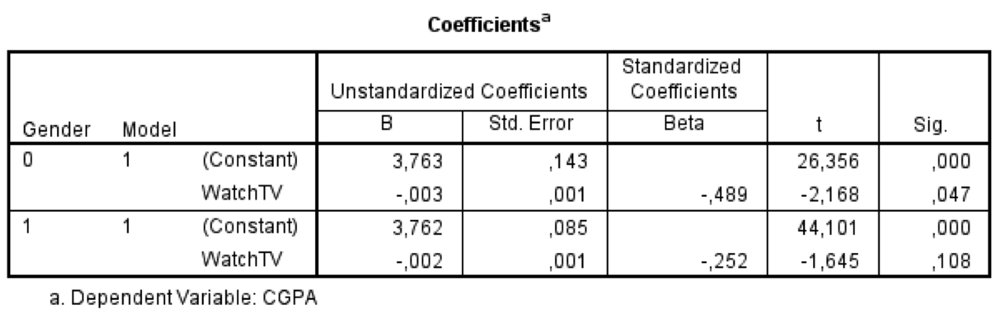

```{r, echo = FALSE, results = "hide"}
include_supplement("Untitled.png", recursive = TRUE)
```

Question
========
Below are the results of two separate regressions are shown (for women and men separately). "**Gender**" is a dummy variable that measures a person's sex (0 = male; 1 = female). The dependent variable "**CGPA**" stands for one's *College Grade Point Average* and measures one's academic performance on a scale of 2.5 (minimum score) to 4.0 (maximum score). "**WatchTV**" is a variable that indicates how many minutes per day a person typically spends watching TV.  
We conduct a two-sided test with α = 0.05 (alpha =5%). As for can we conclude based on these results?   
  


Answerlist
----------
* Among men, watching TV has a significant *negative *influence on one's study performance, among women, watching TV has a significant *positive* influence on one's study performance.
* Among men, watching TV has a significant negative influence on one's study performance, in women watching TV has *no* significant influence on one's study performance.
* In both men and women, watching TV has a significant positive influence on one's study performance.
* In both men and women, watching TV has *no* significant influence on one's study performance.

Solution
========

Language Dutch

Levels of Difficulty Easy

M&T Basics of quantitative research Basics of quantitative research

M&T BIS Default value
Answerlist
----------
* False
* True
* False
* False

Meta-information
================
exname: vufsw-moderation-0028-en
extype: schoice
exsolution: 0100
exshuffle: TRUE
exsection: inferential statistics/regression/multiple linear regression/moderation
exextra[Type]: interpretating output
exextra[Program]: NA
exextra[Language]: English
exextra[Level]: statistical literacy

