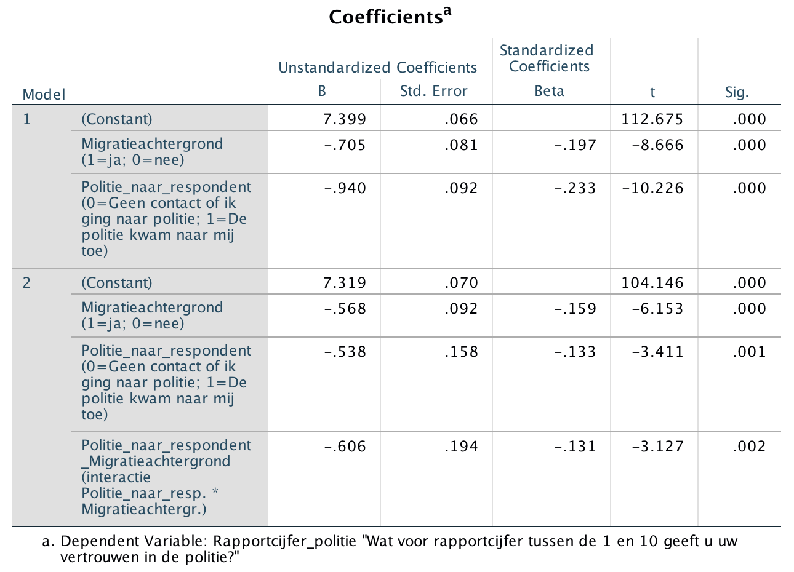

```{r, echo = FALSE, results = "hide"}
include_supplement("Screen__Shot__2020-04-30__at__22.56.25.png", recursive = TRUE)
```

Question
========
Below are the results of a stepwise regression analysis. The dependent variable "**Police Report Rate**" is a person's trust in the police measured on a scale ranging from 1 (very little trust) to 10 (very much trust). "**Migration background** (1 = yes, 0 = no) is a dummy variable that indicates if someone has a migration background. "**Police response**"**is a dummy variable indicating whether a person had contact with the police in the past year because the police came to him/her (score = 1) or, on the other hand, someone had no contact or someone went to the police themselves (score = 0). Finally "**Police-to-response background**"**a multiplicative interaction term of the variables Migration background and Police_to_respondent.  
  
Examine the regression model with the interaction term (Model 2).  
  
Suppose we compare two individuals **without** a migration background with each other, Donny and Klaas Jan. Donny has had contact last year with the police because the police came to him; Klaas Jan had *no* contact with the police in the last year had *no* contact with the police. How much lower is Donny's estimated trust in the police of Donny compared to Klaas Jan?  
  
And now suppose we compare two individuals **with** a migration background, Dušan and each other, Dušan and Hakim. Dušan had contact last year with the police because the police came to him; Hakim had *no* contact with the police during the last year *no* contact with the police. How much lower is the estimated trust in the police of Dušan compared to Hakim?  
  


Answerlist
----------
* Donny has **0.538***less* confidence in the police than Klaas Jan. And Dušan has **1.144** (0.538 + 0.606) *less* trust in the police than Hakim.
* Donny has **0.068** (0.606 - 0.538) *less* trust in the police than Klaas Jan. And Dušan has **0.606***less* trust in the police than Hakim.
* Donny has **1.144** (0.606 + 0.538) *less* trust in the police than Klaas Jan. And Dušan has **0.606***less* trust in the police than Hakim.
* Onny has **0.606***less* trust in the police than Klaas Jan. And Dušan has **1.144** (0.538 + 0.606) *less* trust in the police than Hakim.

Solution
========

Language Dutch

Levels of Difficulty Easy

M&T Basics of quantitative research Basics of quantitative research

M&T BIS Default value
Answerlist
----------
* True
* False
* False
* False

Meta-information
================
exname: vufsw-moderation-0115-en
extype: schoice
exsolution: 1000
exshuffle: TRUE
exsection: inferential statistics/regression/multiple linear regression/moderation
exextra[Type]: interpretating output
exextra[Program]: calculator
exextra[Language]: English
exextra[Level]: statistical literacy

