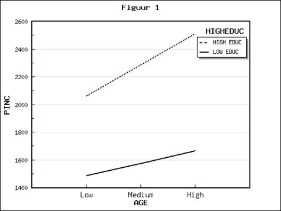

```{r, echo = FALSE, results = "hide"}
include_supplement("1553526000257.png", recursive = TRUE)
```

Question
========
Below are the results of a regression analysis of the influence of age ("**AGE**") on income ("**PINC**"), disaggregated by education category (see Figure 1). The dependent variable "**PINC**" is personal income (net, in euros per month).  The independent variable "**AGE**" is a person's age (in years). "**HIGHEDUC**" is a dummy variable (highly educated = 1; less educated =0); highly educated implies that a person has at least 14 years of education, less educated implies that someone has 14 years or less education.  
There seems to be moderation/interaction in this case. How can you infer this from the figure?   
  


Answerlist
----------
* The level of income is not constant: income increases as people age.
* The share of highly educated people is not constant: this share is higher as people earn more income.
* The difference in income between the highly educated and less educated is not constant: this income difference increases as people age.
* The difference in age between the highly educated and less educated is not constant: this age difference increases as people become more educated are.

Solution
========

Answerlist
----------
* False
* False
* True
* False

Meta-information
================
exname: vufsw-moderation-0169-en
extype: schoice
exsolution: 0010
exshuffle: TRUE
exsection: inferential statistics/regression/multiple linear regression/moderation
exextra[ID]: 53fcb
exextra[Type]: interpretating graph
exextra[Program]: NA
exextra[Language]: English
exextra[Level]: statistical reasoning

