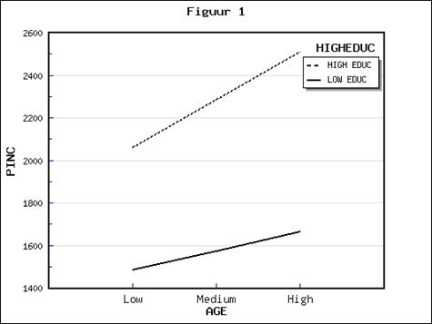

```{r, echo = FALSE, results = "hide"}
include_supplement("1553526000257.png")
```

Question
========
Hieronder zijn de uitkomsten van een regressie-analyse weergegeven van
de invloed van leeftijd ("**AGE**") op inkomen ("**PINC**"),
uitgesplitst naar opleidingscategorie (zie Figuur 1). De afhankelijke
variabele “**PINC**” is persoonlijk inkomen (netto, in euro’s per
maand).  De onafhankelijke variabele “**AGE**” is iemands leeftijd (in
jaren). “**HIGHEDUC**” is een dummy variabele (hoogopgeleid = 1;
laagopgeleid =0); hoogopgeleid houdt in dat iemand minstens 14 jaar
opleiding heeft gevolgd, laagopgeleid houdt in dat iemand 14 jaar of
minder opleiding heeft gevolgd.  
Er lijkt in dit geval sprake te zijn van moderatie/interactie. Hoe kun
je dit uit de figuur afleiden?   
  


Answerlist
----------
* De hoogte van het inkomen is niet constant: het inkomen neemt toe
  naarmate mensen ouder worden.
* Het aandeel hoogopgeleiden is niet constant: dit aandeel is hoger
  naarmate mensen meer inkomen verdienen.
* Het verschil in inkomen tussen hoogopgeleiden en laagopgeleiden is niet
  constant: dit inkomensverschil neemt toe naarmate mensen ouder worden.
* Het verschil in leeftijd tussen hoogopgeleiden en laagopgeleiden is niet
  constant: dit leeftijdsverschil neemt toe naarmate mensen hoger opgeleid
  zijn.

Solution
========


Answerlist
----------
* False
* False
* True
* False

Meta-information
================
exname: vufsw-moderation-0169-nl
extype: schoice
exsolution: 0010
exshuffle: TRUE
exsection: inferential statistics/regression/multiple linear regression/moderation
exextra[Type]: interpretating graph
exextra[Program]: NA
exextra[Language]: Dutch
exextra[Level]: statistical reasoning

