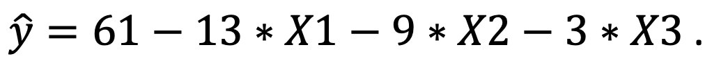

```{r, echo = FALSE, results = "hide"}
include_supplement("Screenshot__2021-03-16__at__15.15.45.png", recursive = TRUE)
```

Question
========
Suppose we conducted a survey and estimated a regression model to examine what factors influence mental health among employees influence. It is predicted that high psychological demands, lack of control over work, and lack of social support at work all reduce mental health.  
  
We measure "**mental health**" (Y) on a scale of 0-100, where a higher score means better mental health. For the characteristics of the job a person has, we distinguish between "**psychological demands**" (*X*1), "**lack of control**" (*X*2) and "**lack of social support**" (*X*3). We measure each independent variable on a scale from 0 (low on this characteristic) to 4 (high on this characteristic).  
  
We find the regression equation below.  
What score for **mental health** would we predict for someone who has a job with no **psychological demands** (score = 0), but who does have a job that scores maximum (4) on **lack of control** and scores maximum (4) on **lack of social support**?  
  


Answerlist
----------
* -39
* 61
* 0
* 13

Solution
========

Answerlist
----------
* False
* False
* False
* True

Meta-information
================
exname: vufsw-moderation-0222-en
extype: schoice
exsolution: 0001
exshuffle: TRUE
exsection: inferential statistics/regression/multiple linear regression/moderation
exextra[Type]: calculation
exextra[Program]: calculator
exextra[Language]: English
exextra[Level]: statistical literacy

