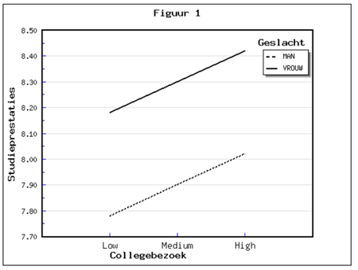

```{r, echo = FALSE, results = "hide"}
include_supplement("1553776532675.png", recursive = TRUE)
```

Question
========
Two regression lines are shown below, for male and female students (see Figure 1). The dependent variable "**study performance**" is measured on a scale of 1 to 10. The variable "**sex**" is a dummy variable (male = 1; female = 0); The variable "**college attendance**" is the extent to which a person attended been to weekly practice lectures ("low" = almost ever; "high" = almost always).  
Is there a moderation effect (interaction effect) in this case of the variable gender? How can you infer this from the figure?   
  


Answerlist
----------
* No, because the difference in study performance between men and women is constant: this difference does not increase or decrease as students attend more attend colleges.
* No, because the difference in college attendance rates between men and women is constant: women are overrepresented in all three groups (low, medium and high) overrepresented.
* Yes, because study performance increases as students attend more frequently attend lectures, and this effect occurs in both males and women.
* Yes, because gender affects study performance: women achieve higher study performance than men.

Solution
========

Language Dutch

Levels of Difficulty Easy

M&T Basics of quantitative research Basics of quantitative research

M&T BIS Default value
Answerlist
----------
* True
* False
* False
* False

Meta-information
================
exname: vufsw-moderation-0230-en
extype: schoice
exsolution: 1000
exshuffle: TRUE
exsection: inferential statistics/regression/multiple linear regression/moderation
exextra[Type]: interpretating graph
exextra[Program]: NA
exextra[Language]: English
exextra[Level]: statistical reasoning

