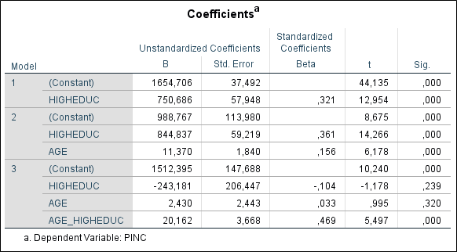

```{r, echo = FALSE, results = "hide"}
include_supplement("1553784283127.png", recursive = TRUE)
```

Question
========
Below are the results of a stepwise regression analysis. The dependent variable "**PINC**" is personal monthly income (net, in euros). "**AGE**" is a person's age in years; "**HIGHEDUC**" is a dummy variable (highly educated = 1; not highly educated =0); Highly educated implies that a person has completed a college or university level education completed or is currently pursuing such an education. "**AGE_HIGHEDUC**" is a multiplicative interaction term of the variables "**AGE**" and "**HIGHEDUC**".  
  
Study the regression model with the interaction term (Model 3).  
  
Suppose we compare two **highly educated** individuals, Boris and Donald. Boris is **1 year older** than Donald. How much higher is the estimated monthly income of Boris compared to Donald?  
  
And now suppose we compare two **lowly educated** individuals compare, Angela and Mark. Angela is **1 year older** than Mark. How much higher is Angela's estimated monthly income compared with Mark?  
  


Answerlist
----------
* Boris earns **22,592** euros (2,430 + 20,162) more than Donald. And Angela earns **2,430** euros more than Mark.
* Boris earns **20,162** euros more than Donald. And Angela earns **2,430** euros more than Mark.
* Boris earns **20,162** euros more than Donald. And Angela earns **17.732 **(20.162 -- 2.430) euros more than Mark.
* Boris earns **22,592** euros (2,430 + 20,162) more than Donald. And Angela earns **17,732 **(20,162 -- 2,430) euros more than Mark.

Solution
========

Language Dutch

Levels of Difficulty Easy

M&T Basics of quantitative research Basics of quantitative research

M&T BIS Default value
Answerlist
----------
* True
* False
* False
* False

Meta-information
================
exname: vufsw-moderation-0244-en
extype: schoice
exsolution: 1000
exshuffle: TRUE
exsection: inferential statistics/regression/multiple linear regression/moderation
exextra[Type]: interpretating output
exextra[Program]: NA
exextra[Language]: English
exextra[Level]: statistical reasoning

