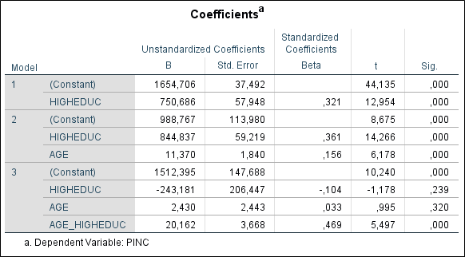

```{r, echo = FALSE, results = "hide"}
include_supplement("1553784283127.png")
```

Question
========
Hieronder staat de resultaten van een stapsgewijze regressie-analyse. De
afhankelijke variabele “**PINC**” is persoonlijk maandinkomen (netto, in
euro’s). “**AGE**” is iemands leeftijd in jaren; “**HIGHEDUC**” is een
dummy variabele (hoogopgeleid = 1; niet hoogopgeleid =0); Hoogopgeleid
houdt in dat iemand een opleiding op HBO of universitair niveau heeft
afgerond of momenteel nog bezig is met zo’n opleiding.
"**AGE\_HIGHEDUC**" is een multiplicatieve interactie-term van de
variabelen "**AGE**" en "**HIGHEDUC**".  
  
Bestudeer het regressiemodel met de interactie-term (Model 3).  
  
Stel, we vergelijken twee **hoogopgeleide** personen met elkaar, Boris
en Donald. Boris is **1 jaar ouder** dan Donald. Hoeveel hoger is het
geschatte maandinkomen van Boris in vergelijking met Donald?  
  
En stel dat we nu twee **laagopgeleide** personen met elkaar
vergelijken, Angela en Mark. Angela is **1 jaar ouder** dan Mark.
Hoeveel hoger is het geschatte maandinkomen van Angela in vergelijking
met Mark?  
  


Answerlist
----------
* Boris verdient **22,592** euro (2,430 + 20,162) meer dan Donald. En
  Angela verdient **2,430** euro meer dan Mark.
* Boris verdient **20,162** euro meer dan Donald. En Angela verdient
  **2,430** euro meer dan Mark.
* Boris verdient **20,162** euro meer dan Donald. En Angela verdient
  **17,732 **(20,162 -– 2,430) euro meer dan Mark.
* Boris verdient **22,592** euro (2,430 + 20,162) meer dan Donald. En
  Angela verdient **17,732 **(20,162 -– 2,430) euro meer dan Mark.

Solution
========


Language  
Nederlands

Levels of Difficulty  
Easy

M&T Basics of quantitative research  
Basics of quantitative research

M&T BIS  
Default value
Answerlist
----------
* True
* False
* False
* False

Meta-information
================
exname: vufsw-moderation-0244-nl
extype: schoice
exsolution: 1000
exshuffle: TRUE
exsection: inferential statistics/regression/multiple linear regression/moderation
exextra[Type]: interpretating output
exextra[Program]: NA
exextra[Language]: Dutch
exextra[Level]: statistical reasoning

