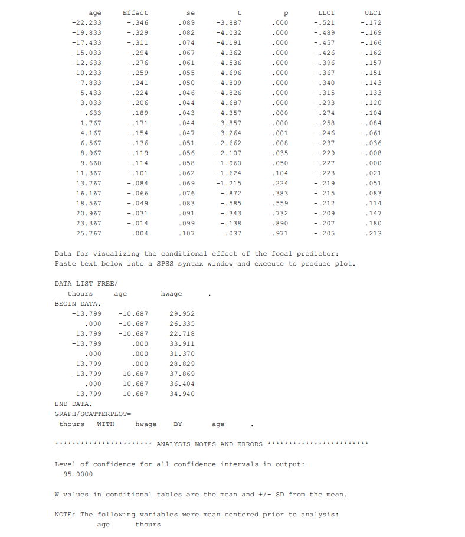

```{r, echo = FALSE, results = "hide"}
include_supplement("1637662117856.png")
include_supplement("1637662133560.png")
include_supplement("1637662152915.png")
```

Question
========
Below is the output of a moderation analysis using the Hayes PROCESS. In
this analysis, we examine whether age moderates the effect of the number
of weekly working hours ("thours") on hourly earnings ("hwage"). The
variables are centred.  
Based on which t-values can we deduce whether there is a moderation
effect ? *Round to 3 decimal places.*  
  





Solution
========


The F-value refers to the F-test of the R2 change: 3.998  
The t-value refers to the t-test of the interaction effect: 2,000


Meta-information
================
exname: vufsw-moderation-0312-en
extype: num
exsolution: 2
extol: 0
exsection: inferential statistics/regression/multiple linear regression/moderation
exextra[Type]: conceptual
exextra[Program]: NA
exextra[Language]: English
exextra[Level]: statistical reasoning

