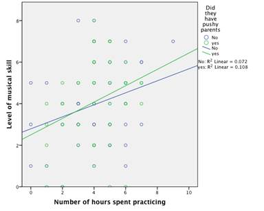

```{r, echo = FALSE, results = "hide"}
include_supplement("image003578f668a.jpg", recursive = TRUE)
```

Question
========
Een onderzoeker heeft een steekproef getrokken onder kinderen die al vijf jaar een muziekinstrument hebben gespeeld. Hij onderzocht of het aantal uren een kind per week oefende met het instrument invloed had op het aantal muzikale examens dat het kind had gehaald (in totaal waren er 8 examens, waarbij het eerste examen het makkelijkst was en het laatste examen het moeilijkst; grafiek uitgedrukt met niveau moeilijkste; grafiek uitgedrukt met niveau van muzikale vaardigheid). De kinderen werd ook gevraagd of hun ouders erg streng waren als het ging om oefenen (wel of niet 'opdringerig'/streng). Wat laat de regressie grafiek hieronder?  
  
  


Antwoordlijst
----------
* Hoe meer een kind oefende, hoe meer muziekexamens het kind maakte. Deze verband was sterker voor de kinderen die strenge ouders hadden vergeleken met de kinderen die geen strenge ouders hadden.
* Hoe meer een kind sportte, hoe meer muziekexamens het maakte. Deze relatie was sterker voor de kinderen die geen strenge ouders, vergeleken met de kinderen die strenge ouders hadden.
* Kinderen met strenge ouders maakten meer muziekexamens dan de kinderen die geen strenge ouders hadden. Deze relatie was sterker voor kinderen die veel sportten, vergeleken met kinderen die weinig sportten. niet veel sportten.
* Kinderen met strenge ouders hadden meer muziekexamens dan de kinderen die geen strenge ouders hadden. Deze relatie was sterker voor kinderen die weinig oefenden, vergeleken met kinderen die veel oefenden.

Solution
========

Het Correcte antwoord is; hoe meer een kind oefende, hoe meer muziekexamens het kind maakte. Deze relatie was sterker voor de kinderen die strenge ouders hadden in vergelijking met de kinderen die geen strenge ouders hadden.

Taal Nederlands

Moeilijkheidsniveaus Gemiddeld

M&T BIS Standaardwaarde

M&T Matiging Standaardwaarde
Antwoordlijst
----------
* Waar
* Onwaar
* Onwaar
* Onwaar

Meta-information
================
exname: vufsw-moderation-1274-nl
extype: schoice
exsolution: 1000
exshuffle: TRUE
exsection: inferential statistics/regression/multiple linear regression/moderation
exextra[Type]: conceptual
exextra[Program]: NA
exextra[Language]: Dutch
exextra[Level]: statistical reasoning

