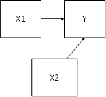
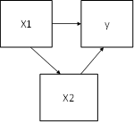
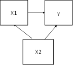
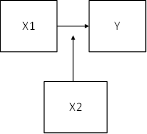

```{r, echo = FALSE, results = "hide"}
include_supplement("1606660757397.png", recursive = TRUE)
include_supplement("1602953834719.png", recursive = TRUE)
include_supplement("1602953846278.png", recursive = TRUE)
include_supplement("1602953860292.png", recursive = TRUE)
include_supplement("1602953874532.png", recursive = TRUE)
```

Question
========
The analyses below are derived from data from the research project Youth and Culture (Ganzeboom and Nagel, 1998-2002) in which More than 3,000 schoolchildren aged 14-17 were surveyed about their attitudes toward culture. Furthermore, information about their social background and their parents' cultural participation. The question is in to what extent the cultural participation of the mother influences the attitudes toward culture of schoolchildren, and whether this influence differs between schoolchildren from Western and non-Western backgrounds.  
  
The dependent variable is "Attitude toward culture" (ATT: a scale 1-4, where a higher score indicates a more positive attitude). Maternal cultural participation (MCUL) is a continuous scale, 0-1, where a higher score means higher participation. The Western versus non-western background of the schoolchildren was measured via the variable 'MIN' (0 = western, 1 = non-western). Also, in model 2, the interaction between 'MIN' and 'MCUL' included (MIN_MCUL).  
  
  

  
Based on the results, which causal model best represents the relationship in the population between attitudes toward culture (ATT = Y), mother's mother's cultural participation (MCUL= X1), and the western or non-Western background of the pupil (MIN = X2)?

Answerlist
----------
* 
* 
* 
* 

Solution
========

Answerlist
----------
* False
* False
* False
* True

Meta-information
================
exname: vufsw-moderation-1306-en
extype: schoice
exsolution: 0001
exshuffle: TRUE
exsection: inferential statistics/regression/multiple linear regression/moderation
exextra[Type]: conceptual
exextra[Program]: NA
exextra[Language]: English
exextra[Level]: statistical reasoning

