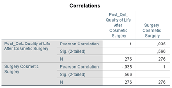
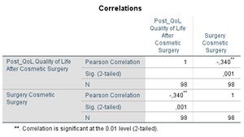
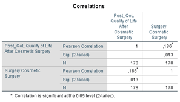
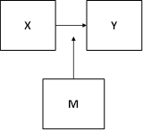
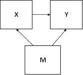
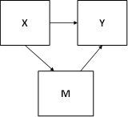

```{r, echo = FALSE, results = "hide"}
include_supplement("1602837169006.png", recursive = TRUE)
include_supplement("1602837181988.png", recursive = TRUE)
include_supplement("1602837197444.png", recursive = TRUE)
include_supplement("1602837695524.png", recursive = TRUE)
include_supplement("1602837678070.png", recursive = TRUE)
include_supplement("1602854063507.png", recursive = TRUE)
include_supplement("1602837664810.png", recursive = TRUE)
```

Question
========
Field describes a study on the growing interest in cosmetic surgical treatments. He collected data on the quality of life among a sample of respondents some of whom part had undergone cosmetic surgery and some were still on the waiting list for it. He also distinguished between the two main reasons for cosmetic surgery: to correct a physical problem, or to change something about appearance without a physical problem.  
  
Below are the results of a correlation analysis in which first the correlation between quality of life (post_qol: a higher number is higher quality) and whether one underwent the surgery (surgery: 0= waiting list, 1 = underwent surgery) for the whole group was shown. Two separate correlation analyses were then done for the group that gave as a reason to change something about appearance (reason = 0, change appearance) and the group that wanted to fix a physical problem wanted to fix (reason = 1, physical reason).  
  

  
Reason = 0 (change appearance)                                        
  

  
 Reason = 1 (physical problem)  

  
 Which causal model best applies to the results of this analysis?

Answerlist
----------
* 
* 
* 
* 

Solution
========

Answerlist
----------
* True
* False
* False
* False

Meta-information
================
exname: vufsw-moderation-1348-en
extype: schoice
exsolution: 1000
exshuffle: TRUE
exsection: inferential statistics/regression/multiple linear regression/moderation
exextra[ID]: 00a85
exextra[Type]: interpreting output
exextra[Program]: NA
exextra[Language]: English
exextra[Level]: statistical literacy

