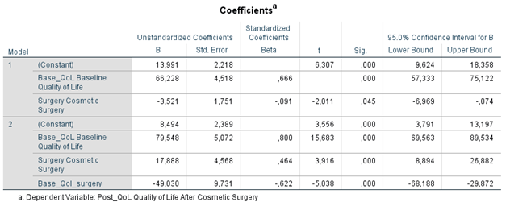

```{r, echo = FALSE, results = "hide"}
include_supplement("1602953152623.png", recursive = TRUE)
```

Question
========
REGRESSION ANALYSIS Field describes a study on the growing interest in cosmetic surgical treatments. He collected data on the quality of life among a sample of respondents, some of whom part of whom had undergone cosmetic surgery and part of whom were still on the waiting list for it (variable: surgery: 0 = waiting list, 1 = cosmetic surgery). He measured the quality of life at registration for the cosmetic surgery, the "baseline" quality of life (variable: Base_Qol, scale 0-1, a higher score means higher quality of quality of life) and after a while, after the surgery had taken place for those who underwent the surgery immediately, but also at the same time for the group who were still on the waiting list (variable: Post\_Qol, scale 0-100, a higher score means a higher quality of life).  
Below are the results of a regression analysis with the post-measurement of quality of life as the dependent variable (Post_Qol), and in which having or not having undergone the cosmetic surgery (Surgery) and the "baseline" quality of life (Base_Qol) in the model are included. In model 2, in addition, the interaction between 'surgery' and 'baseline' quality of life were added to the model (Base_Qol_surgery).  
  

  
What is the quality of life predicted by **model 2** (Post_Qol) of someone who underwent cosmetic surgery and who already had a maximum "baseline" quality of life?

Answerlist
----------
* 8.494
* 56.900
* 88.042
* 105.930

Solution
========

Answerlist
----------
* False
* True
* False
* False

Meta-information
================
exname: vufsw-moderation-1357-en
extype: schoice
exsolution: 0100
exshuffle: TRUE
exsection: inferential statistics/regression/multiple linear regression/moderation
exextra[Type]: interpeting output
exextra[Program]: calculator
exextra[Language]: English
exextra[Level]: statistical thinking

