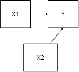
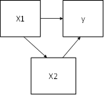
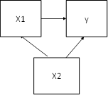
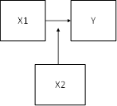

```{r, echo = FALSE, results = "hide"}
include_supplement("1602953152623.png", recursive = TRUE)
include_supplement("1602953834719.png", recursive = TRUE)
include_supplement("1602953846278.png", recursive = TRUE)
include_supplement("1602953860292.png", recursive = TRUE)
include_supplement("1602953874532.png", recursive = TRUE)
```

Question
========
Field describes a study on the growing interest in cosmetic surgical treatments. He collected data on the quality of life among a sample of respondents some of whom some had undergone cosmetic surgery and some were still on the waiting list for it. waiting list for it (variable: surgery: 0 = waiting list, 1 = cosmetic surgery). It measured the quality of life at registration for the cosmetic surgery, the "baseline" quality of life (variable: Base_Qol, scale 0-1, a higher score means higher quality of quality of life) and after a while, after the surgery had taken place for those who underwent the surgery immediately, but also at the same time for the group who were still on the waiting list (variable: Post\_Qol, scale 0-100, a higher score means a higher quality of life).  
  
Below are the results of a regression analysis with the post-measurement of quality of life as the dependent variable (Post-QOL), and in which having or not having undergone the cosmetic surgery (Surgery) and the "baseline" quality of life (Base_Qol) in the model are included. Moreover, in model 2, the interaction between 'surgery' and 'baseline' quality of life were added to the model (Base_Qol_surgery).  
  

  
Which causal model best represents the hypothesized relationship in the population between the post-measurement quality of life (Post\_Qol
= Y), "baseline" quality of life (Base_Qol = X1), and whether or not having undergone cosmetic surgery (Surgery = X2)?

Answerlist
----------
* 
* 
* 
* 

Solution
========

Answerlist
----------
* False
* False
* False
* True

Meta-information
================
exname: vufsw-moderation-1358-en
extype: schoice
exsolution: 0001
exshuffle: TRUE
exsection: inferential statistics/regression/multiple linear regression/moderation
exextra[ID]: e1e13
exextra[Type]: test choice
exextra[Program]: NA
exextra[Language]: English
exextra[Level]: statistical thinking

