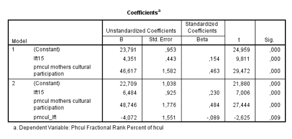

```{r, echo = FALSE, results = "hide"}
include_supplement("Schermafbeelding__2019-01-30__om__14.57.50.png", recursive = TRUE)
```

Question
========
In the output below, a sample of young people aged 14-17 years, the extent to which cultural participation (culpar: continuous scale 1-100: low -&gt; high) depends on age (lft15: in years, 15 years =0) and of mother's cultural participation (pmcul: continuous scale 0-1: low -&gt; high). An interaction term is also included between age and maternal cultural participation (lft|pmcul: calculated as lft15 pmcul).  
  

Based on this analysis from model 2, what conclusion can you draw about the population?  
1: The influence of maternal cultural participation is greater for younger than for older adolescents 2: Age differences decrease as the mother is more culturally active is

Answerlist
----------
* Only statement 1 is correct
* Only statement 2 is correct
* Both statement 1 and statement 2 are correct
* Neither statement is correct

Solution
========

Answerlist
----------
* False
* False
* True
* False

Meta-information
================
exname: vufsw-moderation-2035-en
extype: schoice
exsolution: 0010
exshuffle: TRUE
exsection: inferential statistics/regression/multiple linear regression/moderation
exextra[Type]: interpreting output
exextra[Program]: NA
exextra[Language]: English
exextra[Level]: statistical thinking

