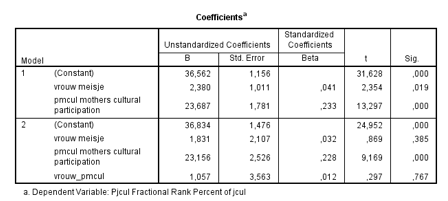

```{r, echo = FALSE, results = "hide"}
include_supplement("Schermafbeelding__2019-01-30__om__14.57.21.png", recursive = TRUE)
```

Question
========
We analyze data obtained from high school students in secondary education from the Youth & Culture Data (Ganzeboom & Nagel, 1998-2002). For this database, over 3,000 young people were surveyed in the age from roughly 14 to 17 years of age.    
  
In the regression analysis below, participation in popular culture is is the dependent variable (pjcul: 1-100, from little to a lot of participation) and the independent variables are gender (female: 0-1, 0= boy, 1 = girl) and maternal cultural participation (pmcul: 0-1, from least to most culturally active). In addition, an interaction added between gender and mothers' cultural participation (female pmcul).  
  

  
What conclusion can you draw from model 2 about the population of schoolchildren?  
1: The effect of gender on participation in popular culture is greater for schoolchildren with highly culturally active mothers than for students with less culturally active mothers 2: For boys, there are no differences in participation in popular culture between those with the least and most culturally active mothers

Answerlist
----------
* Only 1 is TRUE
* Only 2 is TRUE
* Both 1 and 2 are TRUE
* 1 and 2 are both false

Solution
========

Answerlist
----------
* False
* False
* False
* True

Meta-information
================
exname: vufsw-moderation-2047-en
extype: schoice
exsolution: 0001
exshuffle: TRUE
exsection: inferential statistics/regression/multiple linear regression/moderation
exextra[Type]: interpreting output
exextra[Program]: NA
exextra[Language]: English
exextra[Level]: statistical thinking

