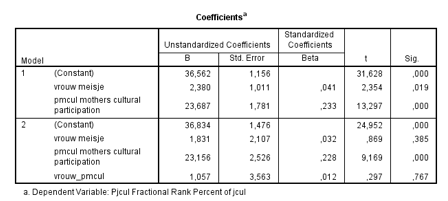

```{r, echo = FALSE, results = "hide"}
include_supplement("Schermafbeelding__2019-01-30__om__14.57.21.png", recursive = TRUE)
```

Question
========
We analyseren data die afkomstig zijn van scholieren van het voortgezet
onderwijs uit de Jongeren & Cultuurdata (Ganzeboom & Nagel, 1998-2002).
Voor dit databestand zijn ruim 3000 jongeren ondervraagd in de leeftijd
van grofweg 14 tot 17 jaar.    
  
In onderstaande regressieanalyse is de participatie in populaire cultuur
de afhankelijke variabele (pjcul: 1-100, van weinig naar veel
participatie) en zijn de onafhankelijke variabelen sekse (vrouw: 0-1, 0=
jongen, 1 = meisje) en moeders cultuurparticipatie (pmcul: 0-1, van
minst naar meest cultureel actief). Er is in model 2 bovendien een
interactie toegevoegd tussen sekse en moeders cultuurparticipatie
(vrouw\_pmcul).  
  
  

  
Welke conclusie kun je uit model 2 trekken over de populatie
scholieren?  
1: Het effect van sekse op de participatie in populaire cultuur is
groter voor scholieren met zeer cultureel actieve moeders dan voor
scholieren met weinig cultureel actieve moeders  
2: Voor leerlingen van de minst cultureel actieve moeders zijn er geen
verschillen in participatie in populaire cultuur tussen jongen en
meisjes

Answerlist
----------
* Alleen 1 is waar
* Alleen 2 is waar
* Zowel 1 als 2 zijn waar
* 1 en 2 zijn beide onwaar

Solution
========


Answerlist
----------
* False
* True
* False
* False

Meta-information
================
exname: vufsw-moderation-2052-nl
extype: schoice
exsolution: 0100
exshuffle: TRUE
exsection: inferential statistics/regression/multiple linear regression/moderation
exextra[ID]: a2301
exextra[Type]: interpreting output
exextra[Program]: NA
exextra[Language]: Dutch
exextra[Level]: statistical thinking

