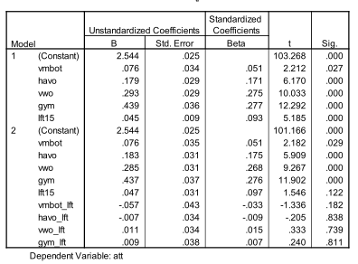

```{r, echo = FALSE, results = "hide"}
include_supplement("Schermafbeelding__2019-01-30__om__17.22.26.png", recursive = TRUE)
```

Question
========
In the regression analysis below, attitude toward culture is the dependent variable (att: 1-4, from negative to positive) and the independent variables are age (lft15 = age -15, so 15 = 0) and school level (in dummies : vmbo-b is the reference category). There is in model 2 added an interaction between age and school level.  
  

  
What conclusion can you draw from model 2 about the population of schoolchildren?  
1: At age 15, grammar school students are more positive about culture than vmbo-b students 2: Older vmbo-b students think more positively about culture than younger vmbo-b students

Answerlist
----------
* Only 1 is TRUE.
* Only 2 is TRUE
* Both 1 and 2 are TRUE
* Both 1 and 2 are false

Solution
========

Answerlist
----------
* True
* False
* False
* False

Meta-information
================
exname: vufsw-moderation-2081-en
extype: schoice
exsolution: 1000
exshuffle: TRUE
exsection: inferential statistics/regression/multiple linear regression/moderation
exextra[ID]: 780d5
exextra[Type]: interpreting output
exextra[Program]: NA
exextra[Language]: English
exextra[Level]: statistical reasoning

