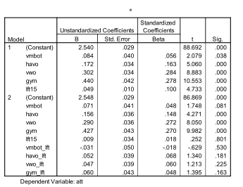

```{r, echo = FALSE, results = "hide"}
include_supplement("Schermafbeelding__2019-01-30__om__17.40.47.png", recursive = TRUE)
```

Question
========
In the regression analysis below, attitude toward culture is the dependent variable (att: 1-4, from negative to positive) and the independent variables are age (lft15 = age -15, so 15 = 0) and school level (in dummies : vmbo-b is the reference category). There is in model 2 added an interaction between age and school level.  
  

  
According to model 2 in the sample, how big is the difference in attitude toward culture between havo and vmbo-b students aged 16 years of age?

Answerlist
----------
* 0.156
* 0.208
* 0.217
* 2.765

Solution
========

Answerlist
----------
* False
* True
* False
* False

Meta-information
================
exname: vufsw-moderation-2082-en
extype: schoice
exsolution: 0100
exshuffle: TRUE
exsection: inferential statistics/regression/multiple linear regression/moderation
exextra[ID]: 75d3f
exextra[Type]: interpreting output
exextra[Program]: calculator
exextra[Language]: English
exextra[Level]: statistical thinking

