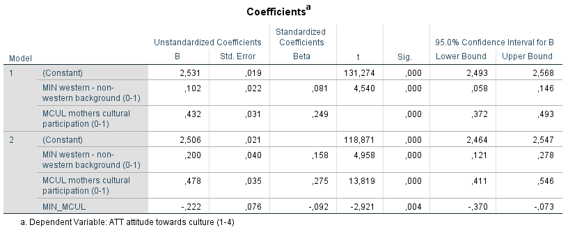

```{r, echo = FALSE, results = "hide"}
include_supplement("1606660757397.png", recursive = TRUE)
```

Question
========
The analyses below are derived from data from the research project Youth and Culture (Ganzeboom and Nagel, 1998-2002) in which More than 3,000 schoolchildren aged 14-17 were surveyed about their attitudes toward culture. Furthermore, information about their social background and their parents' cultural participation. The question is in to what extent the cultural participation of the mother influences the attitudes toward culture of schoolchildren, and whether this influence differs between schoolchildren from Western and non-Western backgrounds.  
  
The dependent variable is "Attitude toward culture" (ATT: a scale 1-4, where a higher score indicates a more positive attitude). Maternal cultural participation (MCUL) is a continuous scale, 0-1, where a higher score means higher participation. The Western versus non-western background of the schoolchildren was measured via the variable 'MIN' (0 = western, 1 = non-western). Also, in model 2, the interaction between 'MIN' and 'MCUL' included (MIN_MCUL).  
  

  
How should the constant of **regression model 1** be interpreted?

Answerlist
----------
* If the lowest score on attitude toward culture (ATT) appearing in the data
* If the predicted score on attitude toward culture (ATT) of a student from a Western background with a mother with very low cultural participation (0)
* If the predicted score on maternal cultural participation (MCUL), of a pupil from a Western background who has a very negative attitude toward culture (ATT = 0)
* If the lowest score on attitude toward culture (ATT) appearing in the data holding constant on maternal cultural participation (MCUL) and the Western versus non-Western background of the pupil (MIN)

Solution
========

Answerlist
----------
* False
* True
* False
* False

Meta-information
================
exname: vufsw-multiple linear regression-1303-en
extype: schoice
exsolution: 0100
exshuffle: TRUE
exsection: inferential statistics/regression/multiple linear regression
exextra[Type]: interpreting output
exextra[Program]: NA
exextra[Language]: English
exextra[Level]: statistical literacy

