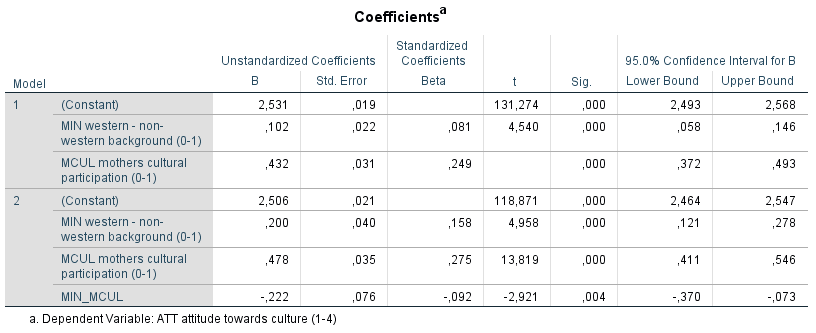

```{r, echo = FALSE, results = "hide"}
include_supplement("1606660757397.png", recursive = TRUE)
```

Question
========
The analyses below are derived from data from the research project Youth and Culture (Ganzeboom and Nagel, 1998-2002) in which More than 3,000 schoolchildren aged 14-17 were surveyed about their attitudes toward culture. Furthermore, information about their social background and their parents' cultural participation. The question is in to what extent the cultural participation of the mother influences the attitudes toward culture of schoolchildren, and whether this influence differs between schoolchildren from Western and non-Western backgrounds.  
  
The dependent variable is "Attitude toward culture" (ATT: a scale 1-4, where a higher score indicates a more positive attitude). Maternal cultural participation (MCUL) is a continuous scale, 0-1, where a higher score means higher participation. The Western versus non-western background of the schoolchildren was measured via the variable 'MIN' (0 = western, 1 = non-western). Also, in model 2, the interaction between 'MIN' and 'MCUL' included (MIN_MCUL).  
  
  

  
What statements can we make about the population?  
1: For schoolchildren from non-western backgrounds, the influence of mother's cultural participation on the attitude towards culture is less strong than for schoolchildren with a Western background.  
2: The differences in attitudes towards culture between students with Western and non-Western backgrounds are stronger the less culturally active the mother is. mother is less culturally active.

Answerlist
----------
* Only statement 1
* Only statement 2
* Both statements
* Neither statement

Solution
========

Answerlist
----------
* False
* False
* True
* False

Meta-information
================
exname: vufsw-multiple linear regression-1307-en
extype: schoice
exsolution: 0010
exshuffle: TRUE
exsection: inferential statistics/regression/multiple linear regression
exextra[ID]: 072ea
exextra[Type]: conceptual
exextra[Program]: NA
exextra[Language]: English
exextra[Level]: statistical reasoning

