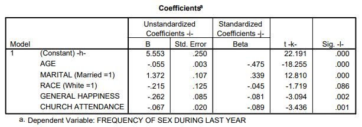

```{r, echo = FALSE, results = "hide"}
include_supplement("capture.png", recursive = TRUE)
```

Question
========
Below is the output of a linear regression, which variable has the strongest effect on the "FREQUENCY OF SEX DURING LAST YEAR"?  
  


Answerlist
----------
* The variable with the strongest effect on the FREQUENCY OF SEX DURING LAST YEAR is **AGE**. This is based on -0.475.
* The variable with the strongest effect on the FREQUENCY OF SEX DURING LAST YEAR is **MARITAL**. That is based on 1.372.
* The variable with the strongest effect on the FREQUENCY OF SEX DURING LAST YEAR is **RACE**. That is based on 0.125.
* The variable with the strongest effect on the FREQUENCY OF SEX DURING LAST YEAR is **GENERAL HAPPINESS**. This is based on -3,094.
* The variable with the strongest effect on the FREQUENCY OF SEX DURING LAST YEAR is **CHURCH ATTENDANCE**. That is based on -0.089.

Solution
========

This is AGE because it has the largest absolute beta -0.475.

Answerlist
----------
* True
* False
* False
* False
* False

Meta-information
================
exname: vufsw-multiplelinearregression-0281-en
extype: schoice
exsolution: 10000
exshuffle: TRUE
exsection: inferential statistics/regression/multiple linear regression
exextra[Type]: interpretating output
exextra[Program]: NA
exextra[Language]: English
exextra[Level]: statistical reasoning

