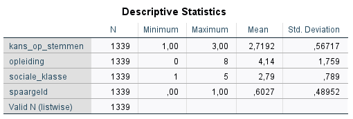
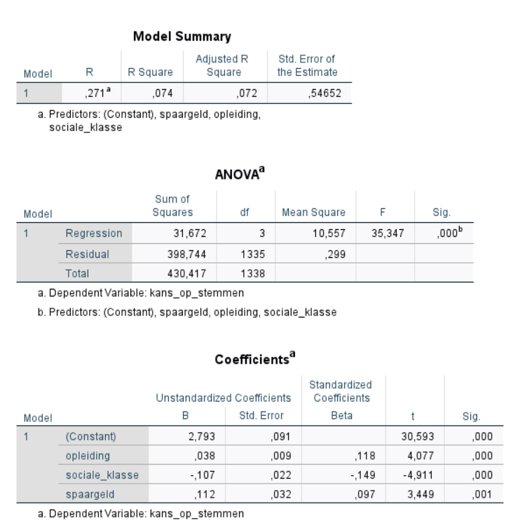

```{r, echo = FALSE, results = "hide"}
include_supplement("1620137896967.png", recursive = TRUE)
include_supplement("1620138066746.png", recursive = TRUE)
```

Question
========
Look at the output below and calculate the probability of voting ("**likelihood of voting**": scale 1-3, where 1 = the probability is minimum, to 3 = the probability is maximum) for someone without savings ("**savings**": 0 none and 1 yes) with an average education ("**education**": scale 0-8, where 0 = no education, up to 8 = highest possible education) and an average social class ("**social_class**": scale 1-5, where 1 = lowest social class 1, up to 5 = highest social class ).  
* Ound to **two **decimals.*  
  

  



Solution
========

probability of voting = 2.793 + 0.038 education - 0.107 social class + 0.112 "savings probability of voting = 2.793 + 0.038*4.14 - 0.107*2.79 + 0.112*0 probability of voting = 2.793 + 0.15732 - 0.29853 +0 probability of voting= 2.65179=2.65

Meta-information
================
exname: vufsw-multiplelinearregression-0328-en
extype: num
exsolution: 2.65
extol: 0.01
exsection: inferential statistics/regression/multiple linear regression
exextra[ID]: e099a
exextra[Type]: calculation
exextra[Program]: calculator
exextra[Language]: English
exextra[Level]: statistical literacy

