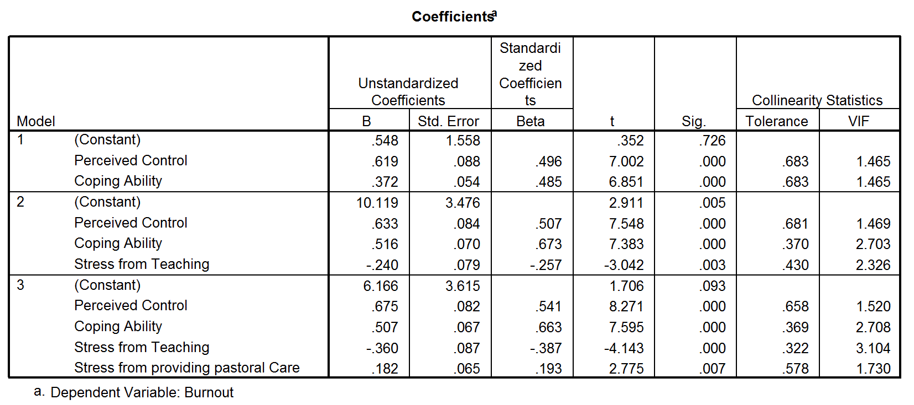
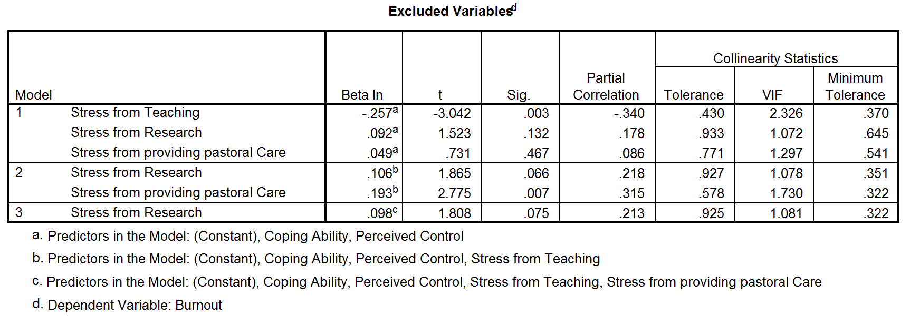

```{r, echo = FALSE, results = "hide"}
include_supplement("Capture6.gif", recursive = TRUE)
include_supplement("Capture12.gif", recursive = TRUE)
```

Question
========
Recent onderzoek heeft aangetoond dat docenten tot de meest gestreste werknemers. Een onderzoeker wilde weten wat het precies was aan het zijn van een dat deze stress en daaropvolgende burn-out veroorzaakt. Ze rekruteerde 75 docenten en nam verschillende vragenlijsten af die de volgende variabelen maten volgende variabelen: ** Burnout ** (hoge score = burn-out),
*  Perceived Control ** (hoge score = lage waargenomen controle), ** Coping Ability ** (hoge score = laag vermogen om met stress om te gaan), **Stress from Lesgeven** (hoge score = lesgeven levert veel stress op voor de persoon), **Stress door onderzoek** (hoge score = onderzoek veroorzaakt veel van stress voor de persoon), en **Stress door pastorale zorg** (hoge score = pastorale zorg verlenen creëert veel stress voor de persoon). persoon). De uitkomst was burn-out. Cooper's (1988) model van stress geeft aan dat waargenomen controle en copingstijl belangrijke voorspellers van deze variabele zijn. De overige variabelen werden gebruikt als voorspellers in de regressie om de unieke bijdrage van verschillende aspecten van het werk van een docent aan hun burn-out.  
  
Welke van de voorspellende variabelen heeft het sterkste effect op burnout volgens de onderstaande output?  
  

  


Answerlist
----------
* Waargenomen controle omdat het de hoogste niet-gestandaardiseerde coëfficiënt heeft
* Copingvaardigheid omdat deze de hoogste gestandaardiseerde coëfficiënt heeft
* Stress voor het lesgeven omdat het de hoogste absolute waarde heeft van de gestandaardiseerde coëfficiënt heeft
* Geen van de andere opties is juist

Solution
========

Als we het effect van verschillende variabelen in dezelfde regressie willen vergelijken, gebruiken we de gestandaardiseerde coëfficiënt (bèta). Zoals te zien is in de tabel met de coëfficiënten heeft de variabele Copingvaardigheid de hoogste bèta (0,663).

Taal Engels

M&T MVA Standaardwaarde

M&T Regressie assumpties Standaardwaarde
Answerlist
----------
* Onwaar
* Waar
* Onwaar
* Onwaar

Meta-information
================
exname: vufsw-multiplelinearregression-1002-nl
extype: schoice
exsolution: 0100
exshuffle: TRUE
exsection: Inferential Statistics/Regression/Multiple linear regression
exextra[ID]: 6de4e
exextra[Type]: interpretating output
exextra[Program]: NA
exextra[Language]: Dutch
exextra[Level]: statistical reasoning

