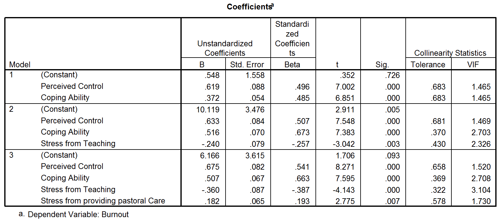

```{r, echo = FALSE, results = "hide"}
include_supplement("Capture7.gif", recursive = TRUE)
```

Question
========
  
Recent onderzoek heeft aangetoond dat docenten tot de meest gestreste werknemers. Een onderzoeker wilde weten wat het precies was aan het zijn van een dat deze stress en daaropvolgende burn-out veroorzaakte. Ze rekruteerde 75 docenten en nam verschillende vragenlijsten af die het volgende maten:
*  Burnout ** (hoge score = burn-out), ** Perceived Control ** (hoge score = laag ervaren controle), ** Copingvaardigheid ** (hoge score = laag vermogen om met stress om te gaan), **Stress van het lesgeven** (hoge score = lesgeven creëert veel stress voor de persoon), **Stress door Research** (hoge score = onderzoek veroorzaakt veel stress bij de persoon), en **Stress van persoon), en **Stress van het verlenen van pastorale zorg** (hoge score = pastorale zorg verlenen creëert veel stress voor de persoon). De uitkomst was burn-out, en Cooper's (1988) model van stress geeft aan dat ervaren controle en copingstijl belangrijke voorspellers van deze variabele zijn. De overige voorspellers werden gemeten om de unieke bijdrage van verschillende aspecten van het werk van een docent aan hun burn-out.  
  
Hoe zou je de bètawaarde voor 'waargenomen controle' in regressie 3?  


Answerlist
----------
* Als de waargenomen controle met één standaarddeviatie toeneemt, neemt de burn-out met 0,541 standaarddeviatie toe. met 0,541 standaarddeviaties toenemen, waarbij rekening wordt gehouden met de andere variabelen. Dus hoe lager de ervaren controle is, hoe lager de burn-out wordt. Het effect is statistisch significant.
* Als de ervaren controle met één eenheid toeneemt, neemt de burn-out met 0,541 eenheden toe, waarbij de andere variabelen in aanmerking worden genomen. eenheden als er rekening wordt gehouden met de andere variabelen. Dus hoe hoger de hoe hoger de ervaren controle is, hoe hoger de burn-out is. Het effect is statistisch significant.
* Naarmate de waargenomen controle met één standaarddeviatie toeneemt, neemt de burn-out met 0,541 eenheden toe, waarbij de andere variabelen in aanmerking worden genomen. met 0,541 eenheden toenemen, waarbij rekening wordt gehouden met de andere variabelen. Daarom, hoe hoger de ervaren controle is, hoe hoger de burn-out wordt. Het effect effect is statistisch significant.
* Als de ervaren controle met één standaarddeviatie toeneemt, neemt de burn-out met 0,541 standaarddeviaties toe. met 0,541 standaarddeviaties toenemen, rekening houdend met de andere variabelen. variabelen. Dus hoe lager de ervaren controle is, hoe hoger de burn-out wordt. Het effect is statistisch significant.

Solution
========

Als X toeneemt met 1 standaardafwijking, dan neemt Y toe met bèta standaardafwijkingen, waarbij rekening wordt gehouden met de andere variabelen. Dit is de definitie van de interpretatie van een gestandaardiseerde coëfficiënt (bèta) in een regressie. Houd er ook rekening mee dat de coëfficiënt positief is en het feit dat hoge waarden van waargenomen controle wijzen op een laag vermogen om met stress om te gaan.

Taal Engels

M&T MVA Standaardwaarde

M&T Regressie assumpties Standaardwaarde
Answerlist
----------
* Onwaar
* Onwaar
* Onwaar
* Waar

Meta-information
================
exname: vufsw-multiplelinearregression-1003-nl
extype: schoice
exsolution: 0001
exshuffle: TRUE
exsection: inferential statistics/regression/multiple linear regression
exextra[Type]: interpretating output
exextra[Program]: NA
exextra[Language]: Dutch
exextra[Level]: statistical reasoning

