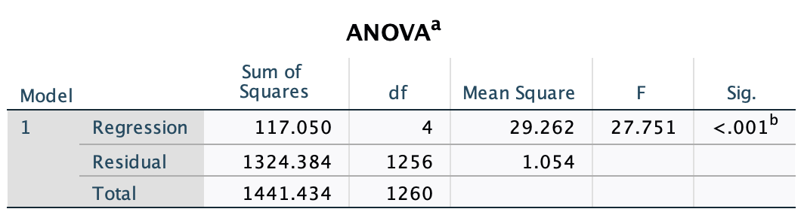

```{r, echo = FALSE, results = "hide"}
include_supplement("1615904596548.png", recursive = TRUE)
```

Question
========
A multiple regression analysis gives the results below.  
What is the **zero hypothesis** in this testing, and what do we conclude when we test with alpha = 0.05 (significance level = 5%)?  
  


Answerlist
----------
* H<sub>0</sub>: all βs are 0. We reject the null hypothesis because the p-value is less than 0.05.
* H<sub>0</sub>: all βs are 0. We reject the null hypothesis **not** because the p-value is smaller than 0,05.
* H<sub>0</sub>: The explained variance (R<sup>2</sup>) = 1. We reject the null hypothesis because the p-value is smaller than 0.05.
* H<sub>0</sub>: The explained variance (R<sup>2</sup>) = 1. We reject the null hypothesis **not** because the p-value is smaller than 0,05.

Solution
========

Answerlist
----------
* True
* False
* False
* False

Meta-information
================
exname: vufsw-nullhypothesis-0227-en
extype: schoice
exsolution: 1000
exshuffle: TRUE
exsection: inferential statistics/nhst/hypothesis/null hypothesis
exextra[Type]: conceptual
exextra[Program]: NA
exextra[Language]: English
exextra[Level]: statistical reasoning

