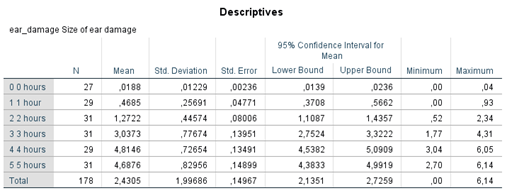
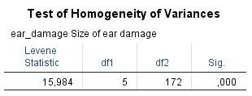
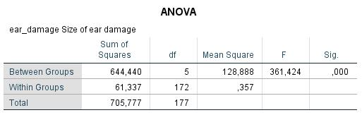
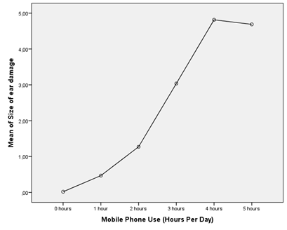
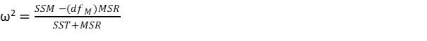

```{r, echo = FALSE, results = "hide"}
include_supplement("1602853914273.png", recursive = TRUE)
include_supplement("1602853939934.png", recursive = TRUE)
include_supplement("1602853960309.png", recursive = TRUE)
include_supplement("1602853971876.png", recursive = TRUE)
include_supplement("1601541221845.png", recursive = TRUE)
```

Question
========
The analysis below deals with the potential harmful effects of cell phones. Field imagines a fictional experiment in which subjects are strapped a cell phone to their head and TRUE in which this phone is turned on for a fixed number of hours each day. After six months, the extent of any damage is measured near the ear (variable: ear damage, amount of ear damage). Six groups distinguished, who 0, 1, 2, 3, 4, or 5 hours per day (variable: usage) were exposed to these 'phone microwaves'.  
 

  
 
  
Calculate the effect size ω. *Give only (!) a number in two decimal places, nothing else.*  
  



Solution
========

Meta-information
================
exname: vufsw-omega squared-1372-en
extype: string
exsolution: solution
exsection: inferential statistics/effect size/omega squared
exextra[Type]: interpreting output
exextra[Program]: calculator
exextra[Language]: English
exextra[Level]: statistical thinking

