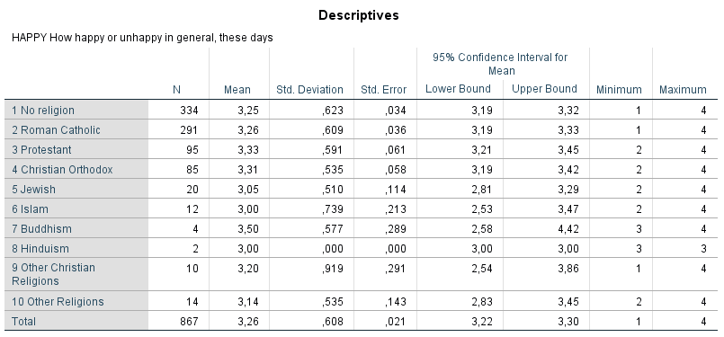

```{r, echo = FALSE, results = "hide"}
include_supplement("1606661124383.png", recursive = TRUE)
include_supplement("1605701561156.png", recursive = TRUE)
include_supplement("1605701548380.png", recursive = TRUE)
include_supplement("1605701537573.png", recursive = TRUE)
include_supplement("1602837664810.png", recursive = TRUE)
include_supplement("1602837678070.png", recursive = TRUE)
include_supplement("1602854063507.png", recursive = TRUE)
include_supplement("1602837678070.png", recursive = TRUE)
```

Question
========
The analyses below are from a representative sample from the Dutch population (ISSP, 2007). The question is whether the "happiness (variable happy: scale 1-4, a higher score means that one is generally overall more often happy) differs between non-religious persons and religious persons of different religions.  
  
  
  
 
  
Which causal model is being tested in this study?

Answerlist
----------
* 
* 
* 
* 

Solution
========

Answerlist
----------
* True
* False
* False
* False

Meta-information
================
exname: vufsw-oneway anova-1318-en
extype: schoice
exsolution: 1000
exshuffle: TRUE
exsection: inferential statistics/parametric techniques/anova/oneway anova
exextra[ID]: b568f
exextra[Type]: conceptual
exextra[Program]: NA
exextra[Language]: English
exextra[Level]: statistical literacy

