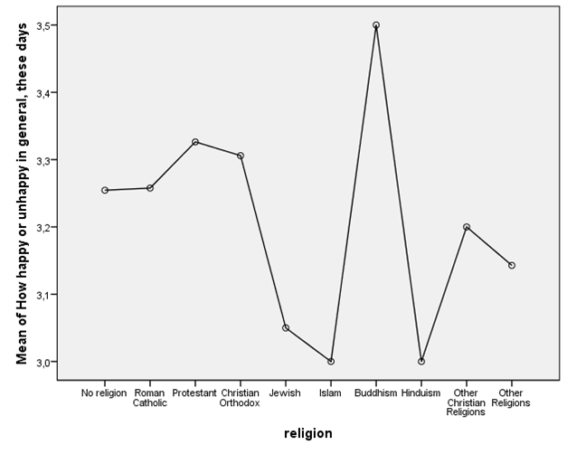
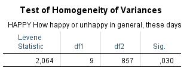

```{r, echo = FALSE, results = "hide"}
include_supplement("1606661124383.png")
include_supplement("1605701561156.png")
include_supplement("1605701548380.png")
include_supplement("1605701537573.png")
```

Question
========
The analyses below are from a representative sample from the Dutch population (ISSP, 2007). The question is whether the "happiness (variable happy: scale 1-4, a higher score means that one is generally overall more often happy) differs between non-religious persons and religious persons of different religions.  

  
  
 
  
What is the alternative H1 hypothesis of this ANOVA?

Answerlist
----------
* H1: all ten groups differ from each other in mean 'happiness'
* H1: all ten groups have the same average 'happiness'
* H1: at least one of the ten groups differs in average 'happiness'
* H1: those with a religion differ in average 'happiness' from those without religion

Solution
========

Answerlist
----------
* False
* False
* True
* False

Meta-information
================
exname: vufsw-oneway anova-1319-en
extype: schoice
exsolution: 0010
exshuffle: TRUE
exsection: inferential statistics/parametric techniques/anova/oneway anova
exextra[ID]: 619e5
exextra[Type]: conceptual
exextra[Program]: NA
exextra[Language]: English
exextra[Level]: statistical literacy

