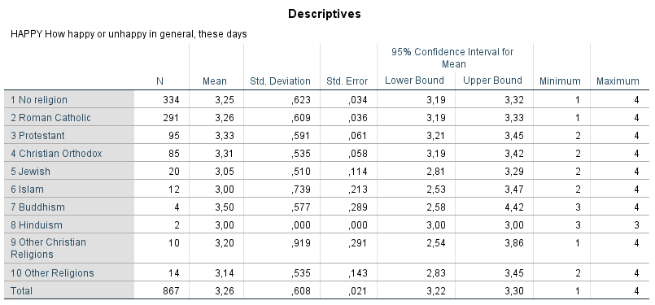
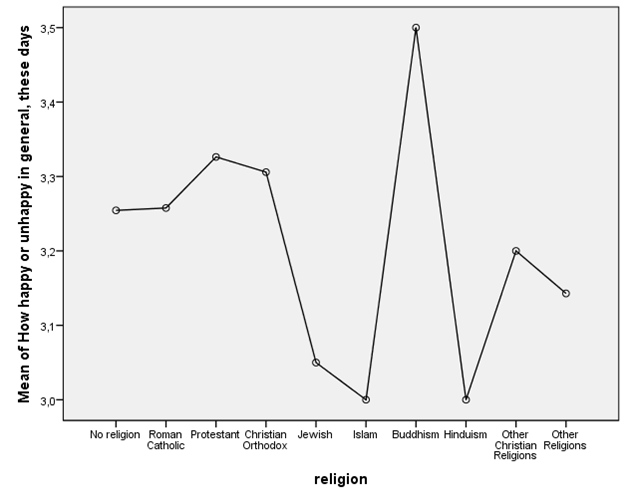
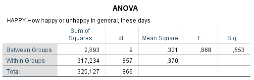
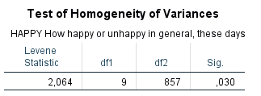
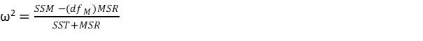

```{r, echo = FALSE, results = "hide"}
include_supplement("1606661124383.png", recursive = TRUE)
include_supplement("1605701561156.png", recursive = TRUE)
include_supplement("1605701548380.png", recursive = TRUE)
include_supplement("1605701537573.png", recursive = TRUE)
include_supplement("1601541221845.png", recursive = TRUE)
```

Question
========
The analyses below are from a representative sample from the Dutch population (ISSP, 2007). The question is whether the "happiness (variable happy: scale 1-4, a higher score means that one is generally overall more often happy) differs between non-religious persons and religious persons of different religions.  

  
  
 
  
  
What is the effect size **ω**<sup>**2**</sup> ?  
  


Answerlist
----------
* -0.00136
* 0.0079
* 0.0080
* 0.9794

Solution
========

Answerlist
----------
* True
* False
* False
* False

Meta-information
================
exname: vufsw-oneway anova-1320-en
extype: schoice
exsolution: 1000
exshuffle: TRUE
exsection: inferential statistics/parametric techniques/anova/oneway anova
exextra[Type]: interpreting output
exextra[Program]: calculator
exextra[Language]: English
exextra[Level]: statistical thinking

