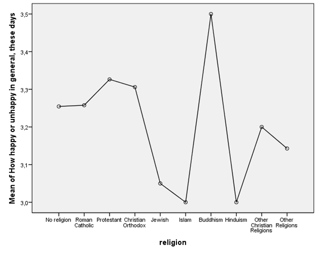

```{r, echo = FALSE, results = "hide"}
include_supplement("1606661124383.png", recursive = TRUE)
include_supplement("1605701561156.png", recursive = TRUE)
include_supplement("1605701548380.png", recursive = TRUE)
include_supplement("1605701537573.png", recursive = TRUE)
```

Question
========
The analyses below are from a representative sample from the Dutch population (ISSP, 2007). The question is whether the "happiness (variable happy: scale 1-4, a higher score means that one is generally overall more often happy) differs between non-religious persons and religious persons of different religions.  
  

  
  
 
  
How can we summarize the results of the analysis?

Answerlist
----------
* The F test indicates that it is plausible that the mean 'happiness' in the groups is not equal in the population, but the assumption of homogeneity of variances is not met the assumption of homogeneity of variances, so we cannot make definitive statements
* The F test shows that there is insufficient evidence that the mean 'happiness' in the groups is not equal in the population, but there is not met the assumption of homogeneity of variances, so we cannot make definitive statements
* The F-test indicates that it is plausible that the mean 'happiness' in the groups is not the same in the population. Because there is the assumption of homogeneity of variances is met, this is the summary of the results.
* The F test indicates that there is insufficient evidence that the mean 'happiness' in the groups is not the same in the population. Because the assumption of the assumption of homogeneity of variances is met, this is the summary of the outcomes.

Solution
========

Answerlist
----------
* False
* True
* False
* False

Meta-information
================
exname: vufsw-oneway anova-1321-en
extype: schoice
exsolution: 0100
exshuffle: TRUE
exsection: inferential statistics/parametric techniques/anova/oneway anova
exextra[Type]: interpreting output
exextra[Program]: NA
exextra[Language]: English
exextra[Level]: statistical thinking

