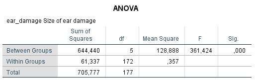

```{r, echo = FALSE, results = "hide"}
include_supplement("1602853914273.png", recursive = TRUE)
include_supplement("1602853939934.png", recursive = TRUE)
include_supplement("1602853960309.png", recursive = TRUE)
include_supplement("1602853971876.png", recursive = TRUE)
```

Question
========
The analysis below deals with the potential harmful effects of cell phones. Field imagines a fictional experiment in which subjects are strapped a cell phone to their head and TRUE in which this phone is turned on for a fixed number of hours each day. After six months, the extent of any damage is measured near the ear (variable: ear damage, amount of ear damage). Six groups distinguished, who 0, 1, 2, 3, 4, or 5 hours per day (variable: usage) were exposed to these 'phone microwaves'.  
 

  
 
  
What is the alternative H1 hypothesis of this ANOVA?

Answerlist
----------
* H1: all six groups differ from each other in mean 'ear-damage'
* H1: all six groups have the same mean 'ear-damage'
* H1: at least one of the six groups differs in mean 'ear-damage'
* H1: the more hours the group was exposed to the cell phone, the greater the ear-damage is.

Solution
========

Answerlist
----------
* False
* False
* True
* False

Meta-information
================
exname: vufsw-oneway anova-1371-en
extype: schoice
exsolution: 0010
exshuffle: TRUE
exsection: inferential statistics/parametric techniques/anova/oneway anova
exextra[ID]: 4f214
exextra[Type]: interpreting output
exextra[Program]: NA
exextra[Language]: English
exextra[Level]: statistical reasoning

