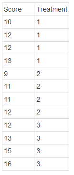

```{r, echo = FALSE, results = "hide"}
include_supplement("1639491244371.png")
```

Question
========
Below is a table showing the data used in a one-way ANOVA to study the
effect of the experimental manipulation ("treatment") on the dependent
variable "score".  
What is the Sum of Squares Model? *Round to one decimal place*.  
  



Solution
========


Meta-information
================
exname: vufsw-onewayanova-0345-en
extype: num
exsolution: 22.2
extol: 0.0999999999999996
exsection: inferential statistics/parametric techniques/anova/oneway anova
exextra[Type]: calculation
exextra[Program]: calculator
exextra[Language]: english
exextra[Level]: statistical reasoning

