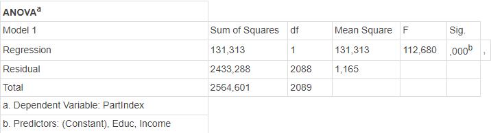

```{r, echo = FALSE, results = "hide"}
include_supplement("1644915328114.png", recursive = TRUE)
```

Question
========
Een onderzoeker voert een regressieanalyse uit met SPSS en krijgt de volgende ANOVA-tabel:  
  

  
Hoeveel variantie van Y wordt verklaard door dit regressiemodel?

Antwoordlijst
----------
* 4.2%
* 4.8%
* 5.1%
* Dit kan niet worden berekend op basis van bovenstaande output.

Solution
========

Je kunt de R<sup>2</sup> berekenen door (totale som van kwadraten -restant) / totale som van kwadraten=(2564.601-2433.288)/ 2564.601= 131,313/2564,601=0,051 Dus 5,1

Moeilijkheidsniveaus Moeilijk

M&T Bivariate lineaire regressie Bivariate lineaire regressie

M&T Multivariate lineaire regressie Standaardwaarde
Antwoordlijst
----------
* Onwaar
* Onwaar
* Waar
* Onwaar

Meta-information
================
exname: vufsw-onewayanova-1247-nl
extype: schoice
exsolution: 0010
exshuffle: TRUE
exsection: inferential statistics/parametric techniques/anova/oneway anova
exextra[Type]: interpretating output
exextra[Program]: calculator
exextra[Language]: Dutch
exextra[Level]: statistical thinking

