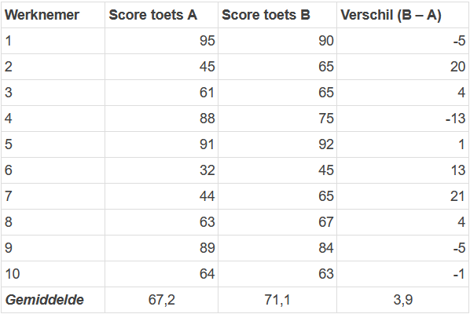

```{r, echo = FALSE, results = "hide"}
include_supplement("1643018916220.png", recursive = TRUE)
```

Question
========
A researcher wants to know whether employees will score better on test B than on test A. To do so, he administers both tests to a random sample of 10 employees to take both tests. The tests are similar in content and A maximum of 100 points can be obtained for each test.  
  
This gives the data below.  
Which statistical test should the researcher use to test the hypothesis test that workers score better on test B than on test A?   
  


Answerlist
----------
* One test for one proportion
* A test for one mean (One-sample t-test)
* An Independent t-test
* A Dependent t-test
* A Chi-squared test (Chi-squared test)

Solution
========

Answerlist
----------
* False
* False
* False
* True
* False

Meta-information
================
exname: vufsw-pairedsamples-0141-en
extype: schoice
exsolution: 00010
exshuffle: TRUE
exsection: inferential statistics/parametric techniques/t test/paired samples
exextra[Type]: test choice,na
exextra[Program]: dutch
exextra[Language]: English
exextra[Level]: NA

